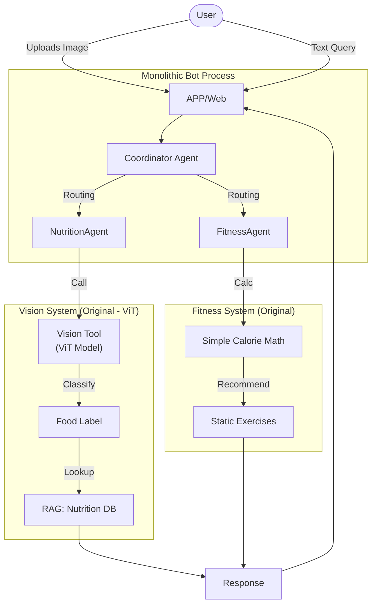
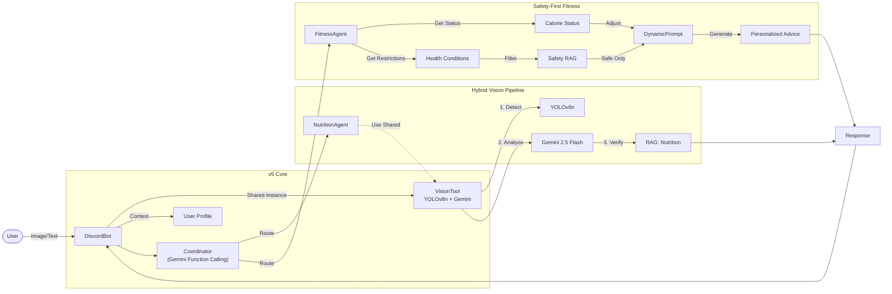
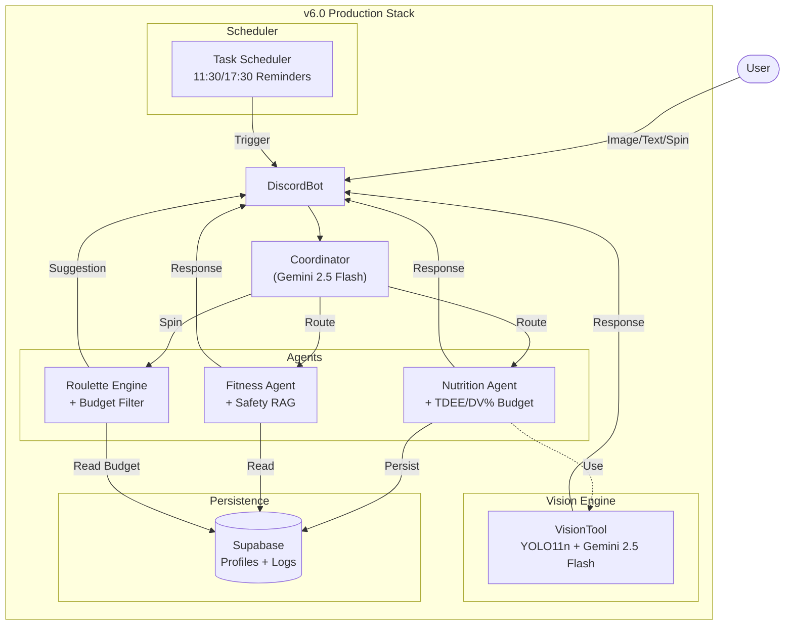
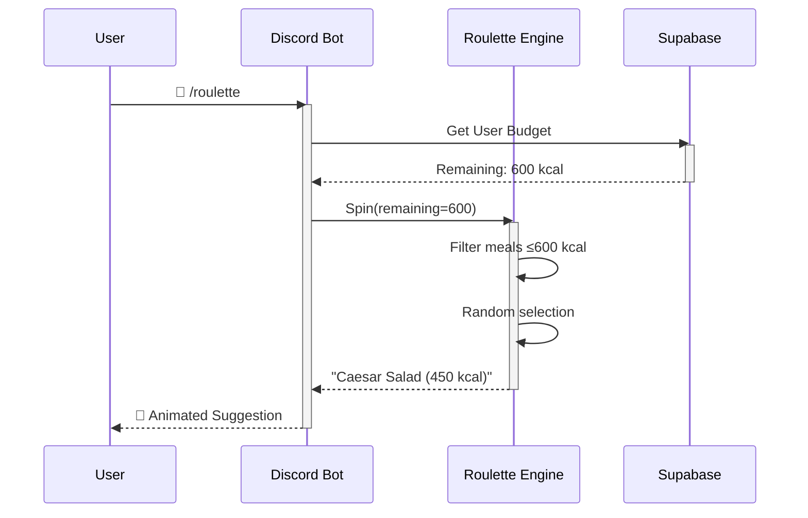
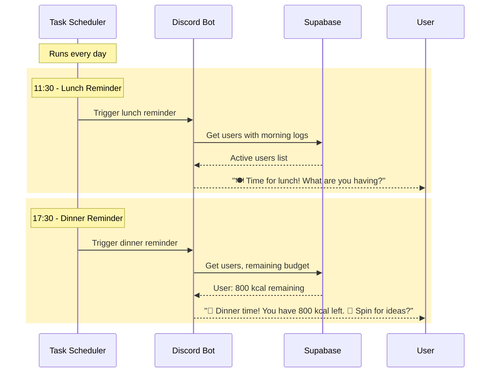
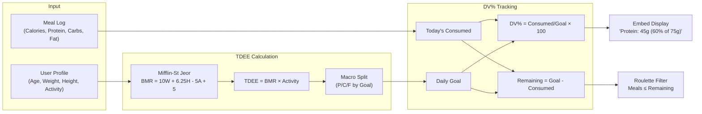

# Architecture Comparison Diagrams

This document visualizes the evolution from Milestone 1 design through v6.0 implementation.

> **Current Version**: v6.1 (Supabase Integration)
> **Last Updated**: March 10, 2026

---

## Diagram 1: Original Design (Milestone 1 - ViT)

**Historical Reference Only** - Replaced in v1.3

*Key Characteristics:*
*   **Model**: ViT (Vision Transformer) for image classification
*   **Linear Flow**: User → Bot → Coordinator → Nutrition Agent → ViT → RAG
*   **Simple Logic**: Fitness Agent was a basic calculator
*   **Single RAG**: Only for nutrition data

```mermaid
graph TD
    User([User]) -->|"Uploads Image"| APP/Web
    User -->|"Text Query"| APP/Web

    subgraph "Monolithic Bot Process"
        APP/Web --> Coordinator[Coordinator Agent]

        Coordinator -->|"Routing"| NutritionAgent
        Coordinator -->|"Routing"| FitnessAgent
    end

    subgraph "Vision System (Original - ViT)"
        NutritionAgent -->|"Call"| VisionTool["Vision Tool\n(ViT Model)"]
        VisionTool -->|"Classify"| Label["Food Label"]

        Label -->|"Lookup"| RAG1[RAG: Nutrition DB]
    end

    subgraph "Fitness System (Original)"
        FitnessAgent -->|"Calc"| formula[Simple Calorie Math]
        formula -->|"Recommend"| StaticEx[Static Exercises]
    end

    RAG1 --> Response
    StaticEx --> Response
    Response --> APP/Web
```

---

## Diagram 2: v5 Implementation (YOLOv8 + Gemini + Safety)

**Completed** - February 2026

*Key Innovations:*
*   **Hybrid Vision**: YOLOv8 (Where?) + Gemini (What?)
*   **Shared Singleton**: Single VisionTool instance
*   **Safety-First Fitness**: Dynamic prompts + 3-Layer RAG Safety Filter
*   **Context-Aware**: Coordinator uses Gemini Function Calling

```mermaid
graph LR
    User([User]) -->|"Image/Text"| DiscordBot

    subgraph "v5 Core"
        DiscordBot -->|"Shared Instance"| VisionSingleton["VisionTool\nYOLOv8n + Gemini"]
        DiscordBot -->|Context| UserProfile["User Profile"]

        DiscordBot --> Coordinator["Coordinator\n(Gemini Function Calling)"]
    end

    Coordinator -->|"Route"| NutritionAgent
    Coordinator -->|"Route"| FitnessAgent

    subgraph "Hybrid Vision Pipeline"
        NutritionAgent -.->|"Use Shared"| VisionSingleton
        VisionSingleton -->|"1. Detect"| YOLO["YOLOv8n"]
        VisionSingleton -->|"2. Analyze"| Gemini["Gemini 2.5 Flash"]
        Gemini -->|"3. Verify"| RAG_Nut[RAG: Nutrition]
    end

    subgraph "Safety-First Fitness"
        FitnessAgent -->|"Get Status"| CalorieCalc["Calorie Status"]
        FitnessAgent -->|"Get Restrictions"| Conditions["Health Conditions"]

        Conditions -->|Filter| RAG_Safe["Safety RAG"]
        RAG_Safe -->|"Safe Only"| DynamicPrompt
        CalorieCalc -->|"Adjust"| DynamicPrompt

        DynamicPrompt -->|Generate| SafeRecs["Personalized Advice"]
    end

    RAG_Nut --> Response
    SafeRecs --> Response
    Response --> DiscordBot
```

---

## Diagram 3: v6.0 Current Architecture (Performance & Play)

**Current Production** - March 2026

*Key Innovations:*
*   **YOLO11**: State-of-the-art food localization
*   **TDEE/DV% Budgeting**: Mifflin-St Jeor calculation + Daily Value tracking
*   **Food Roulette🎰**: Gamified, budget-aware meal suggestions
*   **Proactive Reminders**: Pre-meal triggers (11:30/17:30)
*   **Supabase Persistence**: User profiles, meal logs, macro budgets

```mermaid
graph TB
    User([User]) -->|"Image/Text/Spin"| DiscordBot

    subgraph "v6.0 Production Stack"
        DiscordBot --> Coordinator["Coordinator\n(Gemini 2.5 Flash)"]

        subgraph "Vision Engine"
            VisionSingleton["VisionTool\nYOLO11n + Gemini 2.5 Flash"]
        end

        subgraph "Agents"
            NutritionAgent["Nutrition Agent\n+ TDEE/DV% Budget"]
            FitnessAgent["Fitness Agent\n+ Safety RAG"]
            RouletteEngine["Roulette Engine\n+ Budget Filter"]
        end

        subgraph "Persistence"
            Supabase[("Supabase\nProfiles + Logs")]
        end

        subgraph "Scheduler"
            ReminderSvc["Task Scheduler\n11:30/17:30 Reminders"]
        end
    end

    Coordinator -->|"Route"| NutritionAgent
    Coordinator -->|"Route"| FitnessAgent
    Coordinator -->|"Spin"| RouletteEngine

    NutritionAgent -.->|"Use"| VisionSingleton
    NutritionAgent -->|"Persist"| Supabase
    FitnessAgent -->|"Read"| Supabase
    RouletteEngine -->|"Read Budget"| Supabase

    ReminderSvc -->|"Trigger"| DiscordBot

    VisionSingleton -->|"Response"| DiscordBot
    NutritionAgent -->|"Response"| DiscordBot
    FitnessAgent -->|"Response"| DiscordBot
    RouletteEngine -->|"Suggestion"| DiscordBot
```

---

## Version Comparison Table

| Component | v1.0 (ViT) | v5 (YOLOv8) | v6.1 (Supabase) |
|-----------|------------|-------------|-----------------|
| **Vision Model** | ViT Classifier | YOLOv8n + Gemini | **YOLO11n** + Gemini |
| **Interface** | Streamlit | Discord Bot | Discord Bot |
| **Fitness Logic** | Static | Safety RAG | Safety RAG + **Real Profiles** |
| **Nutrition** | Calorie only | Calorie + Macros | **TDEE/DV% Budget** |
| **Gamification** | ❌ | ❌ | **Food Roulette🎰** |
| **Proactive** | ❌ | ❌ | **11:30/17:30 Reminders** |
| **Persistence** | SQLite | SQLite | **Supabase** |
| **API Key** | Multiple | Multiple | **Unified GOOGLE_API_KEY** |

---

## v6.0 New Component: Food Roulette🎰

```mermaid
sequenceDiagram
    participant User
    participant Bot as Discord Bot
    participant Roulette as Roulette Engine
    participant Supabase

    User->>Bot: 🎰 /roulette
    activate Bot

    Bot->>Supabase: Get User Budget
    activate Supabase
    Supabase-->>Bot: Remaining: 600 kcal
    deactivate Supabase

    Bot->>Roulette: Spin(remaining=600)
    activate Roulette

    Roulette->>Roulette: Filter meals ≤600 kcal
    Roulette->>Roulette: Random selection
    Roulette-->>Bot: "Caesar Salad (450 kcal)"

    deactivate Roulette
    Bot-->>User: 🎰 Animated Suggestion
    deactivate Bot
```

---

## v6.0 New Component: Proactive Reminders

```mermaid
sequenceDiagram
    participant Scheduler as Task Scheduler
    participant Bot as Discord Bot
    participant Supabase
    participant User

    Note over Scheduler: Runs every day

    rect rgb(255, 245, 200)
        Note over Scheduler: 11:30 - Lunch Reminder
        Scheduler->>Bot: Trigger lunch reminder
        Bot->>Supabase: Get users with morning logs
        Supabase-->>Bot: Active users list
        Bot-->>User: "🍽️ Time for lunch! What are you having?"
    end

    rect rgb(255, 245, 200)
        Note over Scheduler: 17:30 - Dinner Reminder
        Scheduler->>Bot: Trigger dinner reminder
        Bot->>Supabase: Get users, remaining budget
        Supabase-->>Bot: User: 800 kcal remaining
        Bot-->>User: "🌆 Dinner time! You have 800 kcal left. 🎰 Spin for ideas?"
    end
```

---

## Data Flow: DV% Budget Tracking

```mermaid
flowchart LR
    subgraph Input
        Profile["User Profile\n(Age, Weight, Height, Activity)"]
        Meal["Meal Log\n(Calories, Protein, Carbs, Fat)"]
    end

    subgraph TDEE_Calc["TDEE Calculation"]
        BMR["Mifflin-St Jeor\nBMR = 10W + 6.25H - 5A + 5"]
        TDEE["TDEE = BMR × Activity"]
        Macros["Macro Split\n(P/C/F by Goal)"]
    end

    subgraph DV_Tracking["DV% Tracking"]
        Consumed["Today's Consumed"]
        Goal["Daily Goal"]
        DV["DV% = Consumed/Goal × 100"]
        Remaining["Remaining = Goal - Consumed"]
    end

    Profile --> BMR --> TDEE --> Macros --> Goal
    Meal --> Consumed

    Consumed --> DV
    Goal --> DV
    Consumed --> Remaining
    Goal --> Remaining

    DV --> Display["Embed Display\n'Protein: 45g (60% of 75g)'"]
    Remaining --> Roulette["Roulette Filter\nMeals ≤ Remaining"]
```

---

*Document Status*: 🟢 Version 6.0 - Production Architecture Diagrams
