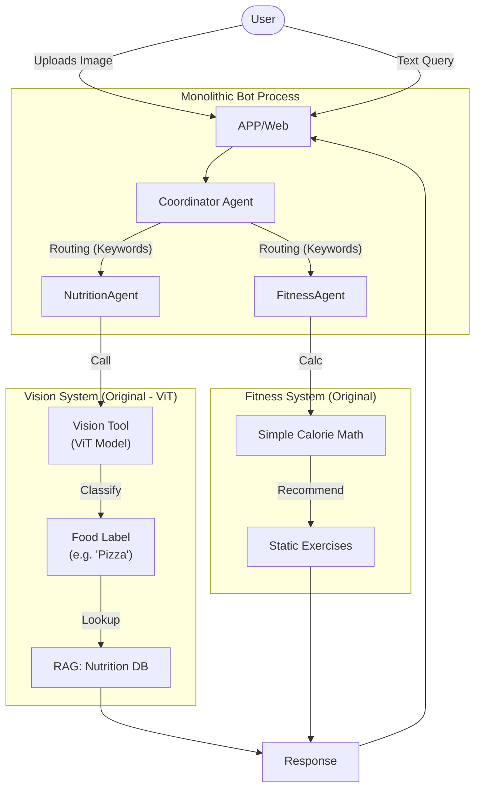
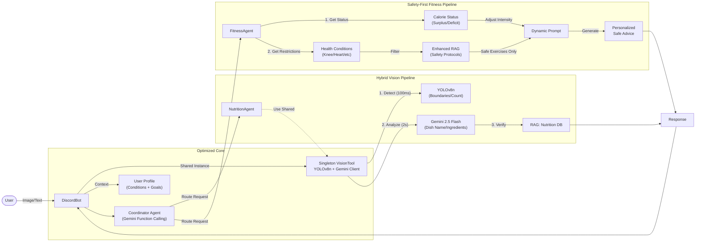

# Architecture Comparison Diagrams

Based on `docs/ARCHITECTURE_COMPREHENSIVE_EVOLUTION.md`, these diagrams visualize the critical evolution from the original Milestone 1 design to the current implementation.

## Diagram 1: Original Design (L2 Architecture v2.0 - ViT)

**Key Characteristics:**
*   **Model**: **ViT (Vision Transformer)** (`StatsGary/VIT-food101-image-classifier`) for image classification.
*   **Linear Flow**: User -> Bot -> Coordinator -> Nutrition Agent -> ViT -> RAG.
*   **Simple Logic**: Fitness Agent was a basic calculator (Calories In - Out).
*   **Single RAG**: Only for nutrition data.

---

## Diagram 2: Actual Implementation (YOLO + Gemini + Safety)

**Key Innovations:**
*   **Hybrid Vision**: YOLO (Where?) + Gemini (What?).
*   **Shared Singleton**: Single `VisionTool` instance passed to all agents.
*   **Safety-First Fitness**: Dynamic prompts + 3-Layer RAG Safety Filter.
*   **Context-Aware**: Coordinator uses Gemini Function Calling & User Profile (Health Conditions).

