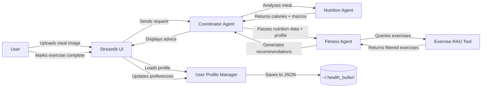

# Design: Enhanced Fitness Agent Architecture

## Context
The Health Butler prototype currently has a basic Fitness Agent that provides generic exercise advice. To deliver on our MVP vision of personalized wellness guidance, we need to enhance it with:
- User-specific recommendations based on health limitations
- Goal setting and progress tracking
- Learning from user preferences over time
- Scientific accuracy in calorie-to-exercise calculations

**Constraints:**
- Must maintain privacy-first approach (no cloud data storage)
- Must integrate seamlessly with existing Nutrition Agent RAG architecture
- Must work within Streamlit session state model
- Must complete within 3-5 day timeline for Phase 2 milestone

**Stakeholders:** Kevin (Fitness module owner), Team (integration), Users (privacy concerns)

## Goals / Non-Goals

**Goals:**
- Create personalized exercise recommendations that adapt to user health limitations
- Track fitness goals and completion history to learn preferences
- Use scientifically accurate MET values for calorie burn calculations
- Maintain user privacy with local-only data storage
- Follow existing RAG architecture patterns for consistency

**Non-Goals:**
- ML-based recommendation engine (too complex for MVP)
- Video exercise library or animations
- Wearable device integrations (future phase)
- Social features or workout sharing
- Complex analytics dashboards

## Decisions

### Decision 1: User Profile Storage Strategy
**Choice:** Local JSON files + Streamlit session state

**Rationale:**
- **Privacy-first:** Aligns with project requirement to store data locally
- **Simple:** No database setup needed for MVP
- **Portable:** Users can backup/transfer their profile JSON
- **Fast:** Sub-100ms load times for small JSON files

**Alternatives Considered:**
- SQLite database: Overkill for single-user MVP, adds complexity
- Cloud storage: Violates privacy requirements
- Browser localStorage: Lost if user clears cache, not accessible for testing

**Implementation:**
```python
# Store in user's home directory
PROFILE_PATH = Path.home() / ".health_butler" / "user_profile.json"

# Load at startup into session state
if "user_profile" not in st.session_state:
    st.session_state.user_profile = UserProfile.load_from_disk()
```

### Decision 2: Exercise Knowledge Source
**Choice:** Compendium of Physical Activities + ChromaDB RAG

**Rationale:**
- **Accurate:** Compendium is the gold standard for MET values (used by CDC, Mayo Clinic)
- **Comprehensive:** 800+ activities covering daily activities to sports
- **Consistent:** Follows same RAG architecture as Nutrition Agent
- **Filterable:** Can query by metadata (contraindications, equipment, intensity)

**Alternatives Considered:**
- Gemini's built-in knowledge: Inconsistent MET values, can't filter by user constraints
- Manual curation: Too time-consuming, harder to maintain
- Commercial API (e.g., Nutritionix): Adds cost and external dependency

**Dataset Processing:**
```python
# Example ChromaDB document structure
{
  "text": "Brisk walking at 3.5 mph burns 4.3 METs. Low impact cardio suitable for most fitness levels.",
  "metadata": {
    "activity": "walking_brisk_3.5mph",
    "met_value": 4.3,
    "category": "cardio",
    "intensity": "moderate",
    "contraindications": [],  # Safe for most people
    "equipment": "none",
    "muscle_groups": ["legs", "core"]
  }
}
```

### Decision 3: Preference Learning Algorithm
**Choice:** Simple frequency counter with weighted randomness

**Rationale:**
- **Simple:** Easy to implement and debug
- **Effective:** Suggests favorites more often without overfitting
- **Variety:** 70% preferred, 30% variety prevents boredom

**Algorithm:**
```python
# Track completion counts
user_profile.exercise_preferences = {
    "walking": 12,  # Completed 12 times
    "yoga": 5,
    "swimming": 2
}

# Calculate recommendation weights
weights = {ex: min(count, 5) for ex, count in preferences.items()}
# Cap at 5x to prevent overfitting

# Sample with 70% from weighted, 30% from all exercises
if random.random() < 0.7:
    exercise = weighted_random(weights)
else:
    exercise = random_from_all()
```

**Alternatives Considered:**
- Collaborative filtering: Requires multiple users, too complex
- Pure frequency: User gets stuck in rut
- Pure random: Doesn't learn preferences

### Decision 4: Goal Tracking Model
**Choice:** SMART goals with simple progress calculation

**SMART Structure:**
```python
class FitnessGoal:
    goal_type: Literal["weight_loss", "muscle_gain", "endurance", "consistency"]
    target_value: float  # e.g., 5 kg loss, 10k run
    current_value: float
    deadline: datetime
    created_at: datetime
    
    @property
    def progress_percent(self) -> float:
        return (self.current_value / self.target_value) * 100
    
    @property
    def days_remaining(self) -> int:
        return (self.deadline - datetime.now()).days
```

**UI Display:**
- Sidebar widget with progress bar
- Color coding: Green (on track), Yellow (falling behind), Red (off track)
- Daily activity summary to update progress

## Data Flow Architecture



## Risks / Trade-offs

### Risk 1: Dataset Availability
**Risk:** Compendium website may be unavailable or require manual download

**Mitigation:**
- Download and commit CSV to repo (`health_butler/data/raw/compendium_2011.csv`)
- Add backup URL in documentation
- Include data validation script to verify completeness

### Risk 2: Contraindication Accuracy
**Risk:** Our manual mapping of injuries to exercise contraindications may be incomplete or medically inaccurate

**Mitigation:**
- Start with conservative, well-known contraindications (e.g., knee injury → no running)
- Add disclaimer in UI: "Consult healthcare provider before starting new exercise"
- Make contraindications configurable in user profile
- Add "Override" option if user wants to try an exercise anyway

### Risk 3: Profile Data Loss
**Risk:** User deletes JSON file or switches devices

**Mitigation:**
- Add "Export Profile" button (downloads JSON)
- Add "Import Profile" button (uploads JSON)
- Clear messaging about where data is stored
- Validation to detect corrupted JSON and recreate with defaults

### Risk 4: Integration Complexity
**Risk:** Coordinator → Nutrition → Fitness handoff may break with new context requirements

**Mitigation:**
- Use existing Swarm handoff patterns (proven in prototype-agent-integration)
- Add fallback: if user_profile missing, use generic recommendations
- Comprehensive integration tests before UI changes
- Incremental rollout: RAG first, then profile, then full integration

## Migration Plan

### Phase 1: Core Infrastructure (Days 1-2)
1. Create `user_profiles.py` with Pydantic models
2. Implement JSON persistence and loading
3. Unit tests for profile CRUD operations
4. Download and commit Compendium CSV
5. Create `exercise_rag_tool.py` (copy pattern from `rag_tool.py`)
6. Ingest script to load exercises into ChromaDB
7. Verify RAG queries work with metadata filtering

**Success Criteria:**
- Profile saves and loads from disk
- Exercise RAG returns results with MET values
- Tests pass

### Phase 2: Fitness Agent Enhancement (Days 2-3)
1. Update `fitness_agent.py` system prompt
2. Integrate user profile access
3. Integrate exercise RAG tool
4. Implement goal setting methods
5. Implement preference tracking logic
6. Unit tests for all new features

**Success Criteria:**
- Agent suggests exercises filtered by contraindications
- Calorie-to-exercise calculations accurate
- Goals can be created and retrieved

### Phase 3: Integration (Days 3-4)
1. Update Coordinator to pass full context
2. Test Nutrition → Fitness handoff
3. Add Streamlit UI components
4. Integration tests for full workflow

**Success Criteria:**
- Full meal → exercise recommendation flow works
- Profile persists across sessions
- UI shows goals and progress

### Phase 4: Validation (Day 5)
1. Run all automated tests
2. Manual end-to-end testing
3. Performance verification
4. Documentation updates

**Rollback Plan:**
- Feature-flagged: Can disable enhanced features if issues arise
- Old fitness_agent.py backed up before modifications
- No breaking changes to existing interfaces

## Open Questions

1. **Should we support multiple user profiles** for family use?
   - **Answer:** No, single user for MVP. Multi-user in next phase if needed.

2. **Include gym equipment exercises** or bodyweight only?
   - **Answer:** Include all, filter by `equipment` metadata based on user's available equipment (configurable in profile).

3. **Notification system** for goal reminders?
   - **Answer:** No push notifications for MVP. Display in UI only.

4. **Data export format** - JSON only or also CSV?
   - **Answer:** JSON for MVP (matches internal format). CSV export can be added later if users request it.

---

**Status:** Draft v1.0 - Ready for Implementation
