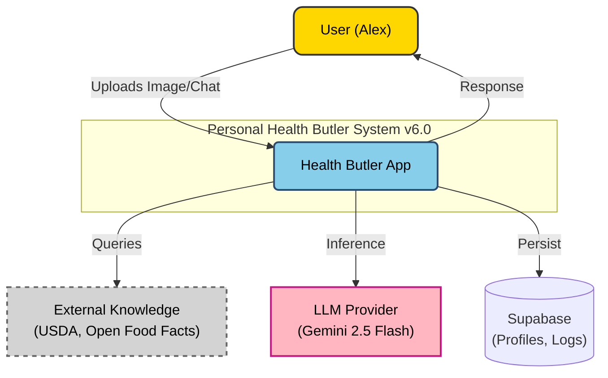
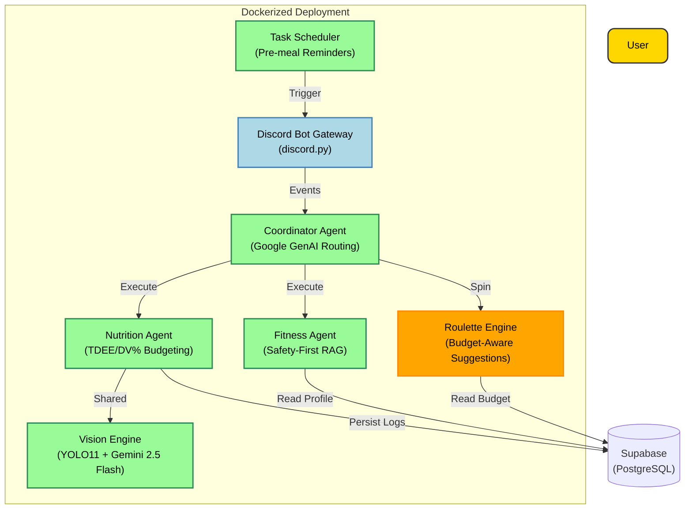

# L2 Application Architecture
# Personal Health Butler AI

> **Version**: 6.1
> **Last Updated**: March 10, 2026
> **Parent Document**: [PRD v6.1](./PRD-Personal-Health-Butler.md)
> **TOGAF Layer**: L2 - Application Architecture

---

## 1. System Overview

### 1.1 C4 Level 1: System Context



### 1.2 C4 Level 2: Container Diagram



---

## 2. Component Design (v6.0)

### 2.1 Service Catalog

| Agent | Responsibility | Key Tech | Status |
|-------|----------------|----------|--------|
| **Discord Bot** | Multi-modal entry point, Onboarding, Rich Embeds | discord.py | Production |
| **Coordinator** | Task Routing, Structured output | Google GenAI | Function Calling |
| **Nutrition Agent** | Food Identity, Macro Breakdown, DV% Tracking | Gemini 2.5 Flash + YOLO11 | Production |
| **Fitness Agent** | Safety-filtered coaching | Safety RAG, MSJ BMR | Production |
| **Roulette Engine** | Budget-aware meal suggestions | Budget filtering + Animation | Production |
| **Task Scheduler** | Pre-meal reminders (11:30/17:30) | discord.py tasks | Production |

### 2.2 Component: Hybrid Vision System (v6.0)
**The core "Eye" of the system, upgraded to YOLO11.**
- **Stage 1: YOLO11 (Physical)**: State-of-the-art food localization and boundary detection (locally).
- **Stage 2: Gemini Flash (Semantic)**: Detailed identification of ingredients, portions, and hidden macros.
- **RAG Verification**: Cross-references Gemini output with USDA nutritional database.

### 2.3 Component: Nutritional Budgeting Engine (v6.0 NEW)
**Provides personalized, actionable nutrition insights.**
- **TDEE Calculation**: Mifflin-St Jeor formula based on user profile (age, weight, height, activity).
- **DV% Tracking**: Real-time "Daily Value %" display for each macro (e.g., "Protein: 45g (60% of goal)").
- **Budget Persistence**: Stored in Supabase, survives session boundaries.

### 2.4 Component: Food Roulette🎰 (v6.0 NEW)
**Gamified meal suggestion engine.**
- **Budget-Aware**: Only suggests meals that fit within remaining calorie budget.
- **Animated UI**: Discord View with spinning animation for engagement.
- **Decision Fatigue Relief**: Solves "what should I eat?" with one-click inspiration.

### 2.5 Component: Safety-First Fitness
**Protects the user using medical-grade filtering logic.**
- **Condition Mapping**: Links health conditions (e.g. Heart Disease) to forbidden exercise patterns.
- **Dynamic BMR**: Calculates daily expenditure using user profile metrics.
- **Surplus/Deficit Logic**: Adjusts exercise intensity based on real-time nutrition logs.

---

## 3. Technology Stack & Integration

### 3.1 LLM Strategy (Tiered)

| Tier | Model | Use Case | Justification |
|------|-------|----------|---------------|
| **Primary** | **Gemini 2.5 Flash** | General Reasoning, Vision | Fast, reliable via google.genai |
| **Fallback** | **DeepSeek-V3 / GLM-4** | Complex reasoning (if needed) | Cost effective |
| **Embedding** | **e5-large-v2** | Knowledge Retrieval | Best-in-class open embedding |

### 3.2 Computer Vision (v6.0)

| Component | Model | Optimization |
|-----------|-------|--------------|
| **Object Detection** | **YOLO11n** | ONNX Runtime for CPU inference |
| **Semantic Analysis** | **Gemini 2.5 Flash** | API call, multimodal |
| **Dataset** | Food-101 fine-tuned | Pre-trained + custom weights |

---

## 4. State Management

### 4.1 Implementation
- **User Profiles**: Persisted in **Supabase** (PostgreSQL).
- **Meal Logs**: Stored in Supabase with timestamp and macro breakdown.
- **Conversation Memory**: In-memory list passed to Agents per session.
- **Macro Budgets**: Calculated on profile change, persisted to Supabase.

### 4.2 Data Flow

1. **User Upload** → Discord Bot receives image/message.
2. Bot calls **Coordinator** with inputs + user context from Supabase.
3. Coordinator maintains conversational context and routes to agents.
4. **Nutrition Agent** runs **YOLO11 + Gemini Vision** → returns macros + DV%.
5. Result stored in Supabase, returned to Discord as rich embed.
6. **Roulette** can be triggered to suggest budget-compliant meals.

---

## 5. Security Architecture (Zero Trust Lite)

- **API Security**: Strict Pydantic validation on all inputs.
- **Secret Management**: `.env` files for keys (Gemini API, Supabase), git-ignored.
- **Input Sanitization**: All text inputs scanned for prompt injection markers.
- **Unified API Key**: `GOOGLE_API_KEY` as single source of truth (v6.0).

---

## 6. Deployment View

```yaml
# docker-compose.yml (Production)
services:
  bot:
    image: capstonetest-bot:latest
    ports: [8085:8080]
    env_file: .env
    healthcheck:
      test: ["CMD", "curl", "-f", "http://localhost:8080/health"]
      interval: 30s
      timeout: 10s
      retries: 3
```

**Scalability Strategy**:
- Single instance sufficient for demo scale.
- Discord Gateway maintains persistent WebSocket connection.
- Supabase handles data persistence with built-in scaling.

---

**Document Status**: 🟢 Version 6.0 - Production Architecture
