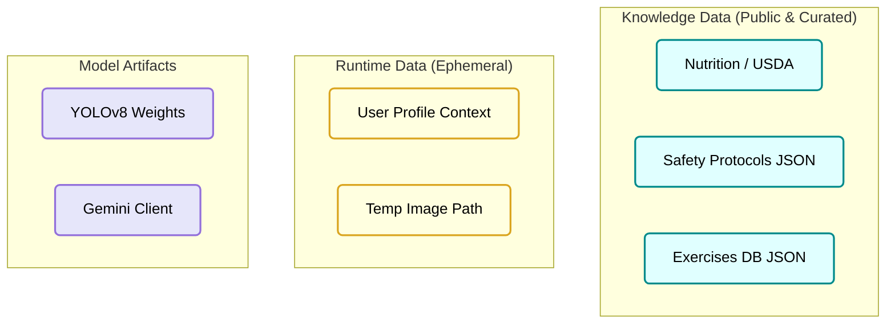

# L3 Data Architecture
# Personal Health Butler AI

> **Version**: 1.2
> **Last Updated**: 2026-01-18
> **Parent Document**: [PRD v1.1](./PRD-Personal-Health-Butler.md)
> **TOGAF Layer**: L3 - Data Architecture

---

## 1. Data Strategy: Hybrid Intelligence

Our system distinguishes between **Pattern Recognition** (done by pre-trained models) and **Factual Knowledge** (sourced from trusted databases) to prevent hallucinations.

| Feature | Data Source | Technology | Update Freq |
|---------|-------------|------------|-------------|
| **Visual Detection** | Pre-trained Patterns | **YOLOv8** (Local Inference) | Build-time |
| **Semantic Vision**| Visual Context | **Gemini 2.5 Flash** (Multimodal) | Real-time |
| **Safety Protocols**| Structured Rules | **safety_protocols.json** | Static / Curated |
| **User Context** | 5-Step Onboarding | **Ephemeral Session** (RAM/Discord) | Session-start |

> **Hybrid Intelligence Strategy**: We combine YOLO's high-speed local containment with Gemini's deep semantic reasoning. Safety is enforced by a secondary "Protocol Layer" (JSON-based) that acts as a hard boundary for LLM recommendations.

---

## 2. Data Architecture Overview

### 2.1 Data Domains



### 2.2 Data Flow & Privacy

-   **Ingestion (Build Time)**: Public data (USDA) -> Chunking -> Vector Store -> **Baked into Container**.
-   **Runtime**: User Image -> RAM -> Inference -> **Delete**.
-   **Privacy Guarantee**: 
    -   No user images are written to disk. 
    -   Images are processed in-memory using `io.BytesIO`.
    -   No conversation logs persist after session end.

---

## 3. Detailed ETL Pipeline (Knowledge Base)

To ensure trusted data, we implement a strict ETL pipeline for the RAG Knowledge Base.

**Source**: `USDA FoodData Central` (JSON API)

1.  **Extract**: Download "Foundation Foods" dataset (approx 30k verified items).
2.  **Transform**:
    -   Clean and normalize fields (Calories, Protein, Fat, Carbs).
    -   Format into text chunks: *"100g of raw Broccoli contains 34 calories, 2.8g protein..."*
3.  **Embed**:
    -   Model: `intfloat/e5-large-v2` (1024 dimensions).
    -   Process: Batch embed -> Normalize vectors.
4.  **Load**:
    -   Build `FAISS` Index (`IndexFlatIP`).
    -   Save `index.faiss` and `metadata.json` to `data/knowledge_base/`.

---

## 4. Storage Architecture

### 4.1 Knowledge Storage (Read-Only)

| Component | Format | Est. Size | Provisioning |
|-----------|--------|-----------|--------------|
| **FAISS Index** | Binary (`.faiss`) | ~500 MB | **Baked into Docker Image** |
| **Metadata** | JSON/SQLite | ~100 MB | **Baked into Docker Image** |
| **YOLO Weights**| `.pt` / `.onnx` | ~15 MB | **Baked into Docker Image** |

*Rationale*: Baking data into the image ensures zero-latency startup and consistency across Cloud Run instances.

### 4.2 Runtime Storage (Ephemeral)

| Data Type | Storage Mechanism | Lifecycle |
|-----------|------------------|-----------|
| **User Images** | `io.BytesIO` (RAM) | Dropped after inference |
| **Chat History** | `Streamlit Session State` | Dropped on tab close |
| **Feedback** | `structlog` (JSON) | Streamed to Cloud Logging (Anonymized) |

---

## 5. Knowledge & Context Schema

### 5.1 User Profile Context (Onboarding)
```json
{
  "name": "Alex",
  "age": 30,
  "gender": "Male",
  "height": 180,
  "weight": 80,
  "goal": "Gain Muscle",
  "activity": "Very Active",
  "conditions": ["Knee Injury"],
  "dietary_prefs": ["High Protein"]
}
```

### 5.2 Safety Protocol Schema
```json
{
  "condition": "Hypertension",
  "forbidden_patterns": ["high intensity interval", "heavy lifting"],
  "recommended_categories": ["low impact cardio", "swimming"],
  "critical_warning": "Avoid isometric exercises that spike blood pressure."
}
```

---

**Document Status**: 🟢 Version 1.2 - Detailed Infrastructure
