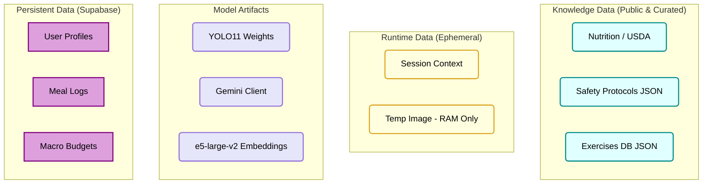

# L3 Data Architecture
# Personal Health Butler AI

> **Version**: 6.1
> **Last Updated**: March 10, 2026
> **Parent Document**: [PRD v6.0](./PRD-Personal-Health-Butler.md)
> **TOGAF Layer**: L3 - Data Architecture

---

## 1. Data Strategy: Hybrid Intelligence

Our system distinguishes between **Pattern Recognition** (done by pre-trained models) and **Factual Knowledge** (sourced from trusted databases) to prevent hallucinations.

| Feature | Data Source | Technology | Update Freq |
|---------|-------------|------------|-------------|
| **Visual Detection** | Pre-trained Patterns | **YOLO11** (Local Inference) | Build-time |
| **Semantic Vision** | Visual Context | **Gemini 2.5 Flash** (Multimodal) | Real-time |
| **Safety Protocols** | Structured Rules | **safety_protocols.json** | Static / Curated |
| **User Context** | 5-Step Onboarding | **Supabase (PostgreSQL)** | Real-time |
| **Meal Logs** | User Interactions | **Supabase (PostgreSQL)** | Real-time |
| **Macro Budgets** | TDEE Calculations | **Supabase (PostgreSQL)** | On profile change |

> **Hybrid Intelligence Strategy**: We combine YOLO11's high-speed local containment with Gemini's deep semantic reasoning. Safety is enforced by a secondary "Protocol Layer" (JSON-based) that acts as a hard boundary for LLM recommendations. User data persists in Supabase for cross-session continuity.

---

## 2. Data Architecture Overview

### 2.1 Data Domains


```mermaid
graph TB
    %% Styles
    classDef know fill:#E0FFFF,stroke:#008B8B,stroke-width:2px,color:black,rx:5,ry:5;
    classDef runtime fill:#FFFFE0,stroke:#DAA520,stroke-width:2px,color:black,rx:5,ry:5;
    classDef model fill:#E6E6FA,stroke:#9370DB,stroke-width:2px,color:black,rx:5,ry:5;
    classDef persistent fill:#DDA0DD,stroke:#800080,stroke-width:2px,color:black,shape:cylinder;

    subgraph "Knowledge Data (Public & Curated)"
        NUT[Nutrition / USDA]:::know
        SAFE[Safety Protocols JSON]:::know
        EX[Exercises DB JSON]:::know
    end

    subgraph "Runtime Data (Ephemeral)"
        SES[Session Context]:::runtime
        IMG[Temp Image - RAM Only]:::runtime
    end

    subgraph "Model Artifacts"
        YOLO[YOLO11 Weights]:::model
        GEM[Gemini Client]:::model
        EMB[e5-large-v2 Embeddings]:::model
    end

    subgraph "Persistent Data (Supabase)"
        PROFILES[User Profiles]:::persistent
        LOGS[Meal Logs]:::persistent
        BUDGETS[Macro Budgets]:::persistent
    end
```

### 2.2 Data Flow & Privacy

- **Ingestion (Build Time)**: Public data (USDA) → Chunking → Vector Store → **Baked into Container**.
- **Runtime**: User Image → RAM → Inference → **Delete**.
- **Persistence**: Profiles, Logs, Budgets → **Supabase**.
- **Privacy Guarantee**:
    - No user images are written to disk.
    - Images are processed in-memory using `io.BytesIO`.
    - User data in Supabase is scoped by `discord_id`.

---

## 3. Supabase Schema (v6.0 NEW)

### 3.1 Table: `profiles`

```sql
CREATE TABLE profiles (
    id UUID PRIMARY KEY DEFAULT gen_random_uuid(),
    discord_id BIGINT UNIQUE NOT NULL,
    name TEXT,
    age INTEGER,
    gender TEXT,
    height_cm FLOAT,
    weight_kg FLOAT,
    goal TEXT,  -- 'lose_weight', 'maintain', 'gain_muscle'
    activity_level TEXT,  -- 'sedentary', 'light', 'moderate', 'active', 'very_active'
    health_conditions TEXT[],  -- Array of conditions
    dietary_preferences TEXT[],  -- Array of preferences
    created_at TIMESTAMPTZ DEFAULT NOW(),
    updated_at TIMESTAMPTZ DEFAULT NOW()
);
```

### 3.2 Table: `meal_logs`

```sql
CREATE TABLE meal_logs (
    id UUID PRIMARY KEY DEFAULT gen_random_uuid(),
    user_id UUID REFERENCES profiles(id) ON DELETE CASCADE,
    discord_id BIGINT NOT NULL,
    logged_at TIMESTAMPTZ DEFAULT NOW(),
    meal_type TEXT,  -- 'breakfast', 'lunch', 'dinner', 'snack'
    foods JSONB,  -- Array of detected foods
    total_calories FLOAT,
    protein_g FLOAT,
    carbs_g FLOAT,
    fat_g FLOAT,
    fiber_g FLOAT,
    notes TEXT
);

-- Index for quick daily lookups
CREATE INDEX idx_meal_logs_user_date ON meal_logs(discord_id, logged_at DESC);
```

### 3.3 Table: `macro_budgets`

```sql
CREATE TABLE macro_budgets (
    id UUID PRIMARY KEY DEFAULT gen_random_uuid(),
    user_id UUID REFERENCES profiles(id) ON DELETE CASCADE,
    discord_id BIGINT UNIQUE NOT NULL,
    tdee_calories FLOAT NOT NULL,  -- Total Daily Energy Expenditure
    protein_goal_g FLOAT,
    carbs_goal_g FLOAT,
    fat_goal_g FLOAT,
    fiber_goal_g FLOAT,
    calculated_at TIMESTAMPTZ DEFAULT NOW()
);
```

---

## 4. Detailed ETL Pipeline (Knowledge Base)

To ensure trusted data, we implement a strict ETL pipeline for the RAG Knowledge Base.

**Source**: `USDA FoodData Central` (JSON API)

1. **Extract**: Download "Foundation Foods" dataset (approx 30k verified items).
2. **Transform**:
    - Clean and normalize fields (Calories, Protein, Fat, Carbs).
    - Format into text chunks: *"100g of raw Broccoli contains 34 calories, 2.8g protein..."*
3. **Embed**:
    - Model: `intfloat/e5-large-v2` (1024 dimensions).
    - Process: Batch embed → Normalize vectors.
4. **Load**:
    - Build `ChromaDB` collection.
    - Persist to `data/chroma_db/`.

---

## 5. Storage Architecture

### 5.1 Knowledge Storage (Read-Only, Baked-in)

| Component | Format | Est. Size | Provisioning |
|-----------|--------|-----------|--------------|
| **ChromaDB Index** | Local DB | ~200 MB | **Baked into Docker Image** |
| **Metadata** | JSON | ~50 MB | **Baked into Docker Image** |
| **YOLO11 Weights** | `.pt` | ~15 MB | **Baked into Docker Image** |
| **Embedding Model** | Cached | ~500 MB | **Cached during build** |

*Rationale*: Baking data into the image ensures zero-latency startup and consistency across deployments.

### 5.2 Persistent Storage (Supabase)

| Data Type | Table | Lifecycle |
|-----------|-------|-----------|
| **User Profiles** | `profiles` | Until user deletes account |
| **Meal Logs** | `meal_logs` | Until user deletes (cascade) |
| **Macro Budgets** | `macro_budgets` | Updated on profile change |

### 5.3 Runtime Storage (Ephemeral)

| Data Type | Storage Mechanism | Lifecycle |
|-----------|------------------|-----------|
| **User Images** | `io.BytesIO` (RAM) | Dropped after inference |
| **Chat History** | In-memory list | Dropped on session end |
| **Feedback** | `structlog` (JSON) | Streamed to Cloud Logging (Anonymized) |

---

## 6. Knowledge & Context Schema

### 6.1 User Profile Context (Onboarding → Supabase)
```json
{
  "discord_id": 123456789012345678,
  "name": "Alex",
  "age": 30,
  "gender": "Male",
  "height_cm": 180,
  "weight_kg": 80,
  "goal": "gain_muscle",
  "activity_level": "very_active",
  "health_conditions": ["knee_injury"],
  "dietary_preferences": ["high_protein"]
}
```

### 6.2 Safety Protocol Schema
```json
{
  "condition": "Hypertension",
  "forbidden_patterns": ["high intensity interval", "heavy lifting"],
  "recommended_categories": ["low impact cardio", "swimming"],
  "critical_warning": "Avoid isometric exercises that spike blood pressure."
}
```

### 6.3 Meal Log Entry
```json
{
  "user_id": "uuid",
  "discord_id": 123456789012345678,
  "logged_at": "2026-03-10T12:30:00Z",
  "meal_type": "lunch",
  "foods": [
    {"name": "Grilled Chicken", "calories": 250, "protein": 35},
    {"name": "Brown Rice", "calories": 200, "carbs": 45}
  ],
  "total_calories": 450,
  "protein_g": 40,
  "carbs_g": 50,
  "fat_g": 10
}
```

---

## 7. TDEE/DV% Calculation (v6.0 NEW)

### 7.1 Mifflin-St Jeor Formula

```
BMR (Male) = 10 × weight(kg) + 6.25 × height(cm) - 5 × age(y) + 5
BMR (Female) = 10 × weight(kg) + 6.25 × height(cm) - 5 × age(y) - 161

TDEE = BMR × Activity Multiplier
```

| Activity Level | Multiplier |
|----------------|------------|
| Sedentary | 1.2 |
| Light | 1.375 |
| Moderate | 1.55 |
| Active | 1.725 |
| Very Active | 1.9 |

### 7.2 Macro Distribution (by Goal)

| Goal | Protein | Carbs | Fat |
|------|---------|-------|-----|
| Lose Weight | 35% | 35% | 30% |
| Maintain | 30% | 40% | 30% |
| Gain Muscle | 30% | 45% | 25% |

### 7.3 DV% Calculation

```
DV% (Protein) = Consumed_Protein / Protein_Goal × 100
Remaining = Goal - Consumed
```

---

**Document Status**: 🟢 Version 6.0 - Production Data Architecture
