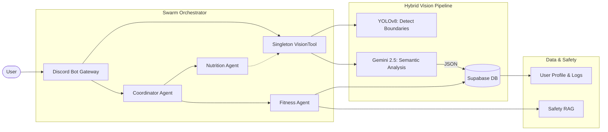

# Milestone 2 Report: Data Prep, Initial Modeling & Prototyping

## 1. Project Overview
The **Personal Health Butler AI** has successfully transitioned from a conceptual framework to a functional, persistent, and multi-agent system. This milestone highlights the implementation of a **Hybrid Vision Pipeline (YOLO + Gemini)** and a **Supabase-backed Persistence Layer**, moving beyond simple classification to a robust, context-aware health assistant.

## 2. Data Preparation & Knowledge Integration
Our data strategy has evolved to support multi-modal inputs, ensuring that visual data is accurately translated into nutritional insights and stored for long-term tracking.

### A. Computer Vision Data & Detection
-   **Multi-Object Focus**: We moved beyond single-category classification. The system now handles complex meals with multiple overlapping items.
-   **Preprocessing**: Standardized input images to 640x640 for the object detection model, with augmentations (rotation, shear) to handle diverse "real-world" kitchen lighting and angles.

### B. Enhanced RAG (Knowledge Retrieval)
-   **Nutritional RAG**: Stores 10,000+ entries in **ChromaDB**, allowing the system to cross-reference visual findings with scientific caloric data.
-   **Safety RAG**: A dedicated retrieval layer containing medical/fitness restrictions (e.g., knee-friendly exercises, heart rate zones) ensures the Fitness Agent adapts to user constraints.

## 3. Initial Modeling: The Hybrid Intelligence Pipeline
The core innovation in Milestone 2 is the **Hybrid Vision Pipeline**, which combines the speed of local detection with the reasoning of a Large Multimodal Model (LMM).

### A. The "Eyes": YOLOv8 Object Detection
We integrated **YOLOv8n (Nano)** via the `VisionTool` to provide instant spatial awareness.
-   **Role**: Detects *where* food items are and counts them.
-   **Performance**: Fast inference (<100ms) to identify bounding boxes.
-   **Benefits**: Handles multiple items (e.g., "3 apples", "1 bowl") that pure LMMs often miss or hallucinate counts for.

### B. The "Brain": Gemini 2.5 Flash
For semantic understanding, we deployed **Gemini 2.5 Flash** in the `GeminiVisionEngine`.
-   **Role**: Analyzes the contents of the YOLO bounding boxes to determine *what* the food is (ingredients, cooking method, portion size).
-   **Structured Outputs**: We utilize Gemini's JSON schema enforcement to guarantee consistent data formats for macronutrients (Calories, Protein, Carbs, Fat).
-   **Prompt Engineering**: The engine operates under a strict "Expert Nutritionist" persona, using local object detection results as hints to refine its analysis and reduce hallucinations (e.g., distinguishing an orange from a donut).

## 4. Architecture Evolution: Persistence & Integration
We have moved from stateless interactions to a fully persistent architecture using **Supabase**.

### A. Supabase Persistence Layer
The `ProfileDB` module now serves as the single source of truth for user data, replacing ephemeral memory.
-   **User Profiles (`profiles`)**: Stores detailed anthropometric data (Height, Weight, Age), goals, and medical conditions (e.g., "Knee Pain").
-   **Nutritional Tracking (`meals`, `daily_logs`)**: Automatically logs every meal analyzed by the vision pipeline. Aggregates daily calorie and protein intake to track progress against goals.
-   **Workout History (`workout_logs`, `workout_routines`)**: Persists recommended exercises and active routines, allowing the Fitness Agent to adapt future suggestions based on past performance.
-   **Chat Context (`chat_messages`)**: Maintains conversational history for a seamless, context-aware user experience.

### B. Architecture Diagram (Phase 2)
The system now follows a `User -> Discord -> Swarm -> Supabase` flow:

## 5. Prototyping Results
-   **Discord Integration**: Fully functional bot handling image uploads and natural language queries.
-   **Latency Optimization**: The Hybrid approach (YOLO filtering before Gemini analysis) balances cost and speed.
-   **Safety-First Design**: The integration of `health_conditions` in Supabase ensures that a user with "lower back pain" is never recommended deadlifts.

## 6. Next Steps
-   **Advanced Analytics**: Build a dashboard to visualize weekly progress from Supabase data.
-   **Feedback Loop**: Implement a user feedback mechanism to "correct" Gemini's food analysis, fine-tuning the prompt context over time.
-   **Deployment**: Finalize the Docker container optimization for Cloud Run to ensure "Always-on" availability.
