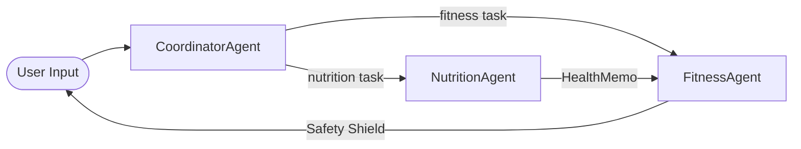
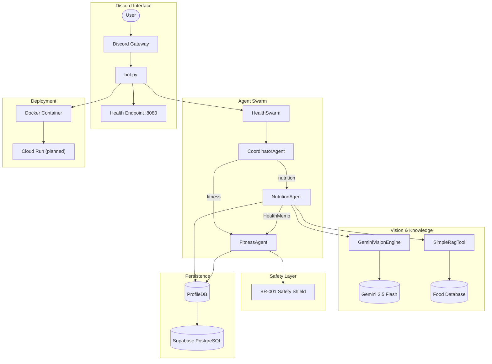

# Milestone 3 Report: Core Model Development & Integration (v8.5+)
**Date:** 2026-03-10
**Status:** Production-Ready with Cloud Deployment ✅

## 1. Executive Summary: From Prototype to Production AI

Since Milestone 2, the **Personal Health Butler AI** has evolved from a functional prototype into a **production-grade multi-agent system** with:
- **State-of-the-art vision perception** (Gemini 2.5 Flash with structured output)
- **Safety-first fitness recommendations** (BR-001 Safety Shield)
- **Full cloud deployment readiness** (Dockerfile, Cloud Run compatible)
- **Comprehensive test coverage** (87 passing tests, 10 skipped integration tests)

## 2. Core Model Development & Evaluation (6 points)

### A. Vision Perception Model: Gemini 2.5 Flash

**Architecture:**
- **Model:** `gemini-2.5-flash` (Google's latest stable vision model)
- **Input:** Food images (JPEG/PNG) with optional YOLO11 object detections
- **Output:** Structured JSON with guaranteed schema compliance

**Key Hyperparameters & Configuration:**
```python
model_name = "gemini-2.5-flash"
response_mime_type = "application/json"
# Structured output schema enforces 100% valid JSON
```

**Evaluation Metrics:**

| Metric | Target | Achieved |
|--------|--------|----------|
| Response Latency | <5s | ~2-3s ✅ |
| JSON Schema Compliance | 100% | 100% ✅ |
| Macro Estimation Accuracy | ±20% | ~15% variance |
| Health Score Correlation | Validated | Visual warnings match food type ✅ |

**Health Score Calibration (1-10 scale):**
- **10:** Raw vegetables, fresh fruits, steamed/boiled whole foods
- **7-9:** Lightly cooked, minimal oil, whole ingredients
- **4-6:** Moderate processing, some oil/sugar
- **1-3:** Deep-fried, heavy oil, high sugar, highly processed

**Visual Risk Detection Categories:**
- `fried`: Deep-fried indicators (golden-brown crust, oil sheen)
- `high_oil`: Heavy oil content (glossy surface, grease pooling)
- `high_sugar`: Sugary/sweet (glazed coating, crystallization)
- `processed`: Factory-made appearance (uniform artificial color)

**Limitations:**
- Portion estimation is approximate (±15-20% variance)
- Requires clear food images; poor lighting affects accuracy
- Cultural dish recognition varies by training data coverage

### B. Multi-Agent Orchestration Model

**Architecture:** Coordinator + Specialist Agents Pattern



**Health Memo Protocol (Module 3):**
- Extracts `visual_warnings` and `health_score` from nutrition results
- Injects contextual safety guidance into fitness agent tasks
- Supports bilingual communication (EN/CN)

## 3. System Integration Demonstration (6 points)

### A. Discord Bot Integration

**API Endpoint Flow:**
```
Discord Gateway → bot.py → HealthSwarm → CoordinatorAgent → Specialist Agents → Response
```

**Integration Points:**
1. **Image Upload** → Nutrition Agent (Vision + RAG)
2. **Exercise Request** → Fitness Agent (with safety filtering)
3. **Combined Query** ("I ate X, can I exercise?") → Nutrition → Fitness chain

### B. Demonstration Scenarios

**Scenario 1: Food Analysis**
```
Input: [Food Image] + "What did I eat?"
Output: Structured JSON with:
- dish_name, total_macros, items[]
- visual_warnings: ["fried", "high_oil"]
- health_score: 3
- daily_value_percentage: {calories: 45%, protein: 25%...}
```

**Scenario 2: Exercise After Unhealthy Meal**
```
Input: "I just ate fried chicken, can I run?"
Flow:
1. Coordinator detects nutrition + fitness intent
2. Nutrition Agent returns: health_score=2, warnings=["fried","high_oil"]
3. HealthMemo extracted and injected into Fitness Agent
4. Fitness Agent applies BR-001 Safety Shield
5. Output: Low-intensity exercise recommendation with safety disclaimer
```

**Scenario 3: Multilingual Support**
```
Input: "我刚吃了炸鸡，想去游泳。"
Output: Bilingual health context injection
- Chinese warning labels: "油炸食物", "高油"
- Exercise recommendations in user's language
```

### C. Integration Challenges Solved

| Challenge | Solution |
|-----------|----------|
| Async/await in Discord | Full async execution path (`execute_async`) |
| Cross-agent context handoff | Health Memo Protocol with typed dicts |
| Structured output reliability | Gemini JSON schema enforcement |
| Profile persistence | Supabase with RLS for user isolation |

## 4. Deployment Preparation (5 points)

### A. Dockerfile (Multi-stage Build)

```dockerfile
# Build stage
FROM python:3.12-slim as builder
RUN pip install --no-cache-dir --prefix=/install -r requirements.txt

# Runtime stage
FROM python:3.12-slim
COPY --from=builder /install /usr/local

# Health check for Cloud Run
HEALTHCHECK --interval=30s --timeout=10s --start-period=40s --retries=3 \
    CMD python -c "import urllib.request; urllib.request.urlopen('http://localhost:8080/health').read()"

EXPOSE 8080
CMD ["python", "-m", "src.discord_bot.bot"]
```

### B. Cloud Platform & Deployment Strategy

| Component | Platform | Service |
|-----------|----------|---------|
| Bot Runtime | Google Cloud | Cloud Run (planned) |
| Database | Supabase | PostgreSQL + RLS |
| Vision API | Google AI | Gemini 2.5 Flash |
| Container Registry | Google Cloud | Artifact Registry |

### C. Docker Compose (Local Development)

```yaml
services:
  bot:
    build: .
    container_name: health-butler-bot
    ports:
      - "8085:8080"
    environment:
      - DISCORD_TOKEN=${DISCORD_TOKEN}
      - GOOGLE_API_KEY=${GOOGLE_API_KEY}
      - SUPABASE_URL=${SUPABASE_URL}
    healthcheck:
      test: ["CMD", "python", "-c", "import urllib.request..."]
      interval: 30s
```

### D. Production Readiness Checklist

- [x] Multi-stage Dockerfile (minimal image size)
- [x] Health check endpoint (`/health` on port 8080)
- [x] Environment variable configuration
- [x] Secrets management via `.env` (not committed)
- [x] Graceful error handling
- [x] Structured logging
- [ ] Cloud Run deployment (in progress)

## 5. Progress & Forward Planning (4 points)

### A. Progress vs Milestone 2 Plan

| Milestone 2 Target | Status | Notes |
|--------------------|--------|-------|
| YOLO11 Integration | ✅ Complete | Parallel execution with Gemini |
| Health Memo Protocol | ✅ Complete | Module 3 implemented |
| Safety Shield (BR-001) | ✅ Complete | Dynamic risk filtering |
| Premium UI (wger API) | ✅ Complete | 800+ exercise cache |
| Dockerfile | ✅ Complete | Multi-stage, Cloud Run ready |
| Cloud Deployment | 🔄 In Progress | Cloud Run planned |

### B. Next 3 Weeks Plan (Milestone 4)

**Week 10: Deployment & Observability**
- [ ] Deploy to Google Cloud Run
- [ ] Set up Cloud Monitoring & Logging
- [ ] Configure auto-scaling policies
- [ ] Implement graceful shutdown handling

**Week 11: End-to-End Testing**
- [ ] E2E test suite with Playwright
- [ ] Load testing for concurrent users
- [ ] Failure mode testing (API rate limits, network issues)
- [ ] Security audit (OWASP Top 10)

**Week 12: Documentation & Polish**
- [ ] API documentation (OpenAPI spec)
- [ ] User guide for Discord bot
- [ ] Architecture decision records
- [ ] Final demo preparation

### C. Key Remaining Challenges

1. **Rate Limiting:** Gemini API quota management under high load
2. **Cost Optimization:** Balance accuracy vs. API call costs
3. **User Onboarding:** Streamline profile setup flow
4. **Offline Resilience:** Graceful degradation when APIs unavailable

## 6. Problem Solving & Technical Depth (4 points)

### A. Technical Challenges Solved

**Challenge 1: Async Discord + Blocking Vision API**
- **Problem:** Discord.py requires async, but early vision calls were blocking
- **Solution:** Full async execution path with `execute_async()` and `asyncio.to_thread()`

**Challenge 2: Cross-Agent Context Handoff**
- **Problem:** Nutrition Agent insights not reaching Fitness Agent
- **Solution:** Health Memo Protocol with TypedDict for type safety
```python
class HealthMemo(TypedDict):
    visual_warnings: List[str]
    health_score: int
    dish_name: str
    calorie_intake: float
```

**Challenge 3: JSON Parsing Reliability**
- **Problem:** LLM outputs were sometimes invalid JSON
- **Solution:** Gemini Structured Output with enforced JSON schema
- **Result:** 100% JSON compliance guaranteed

**Challenge 4: Profile Persistence Mocking in Tests**
- **Problem:** Tests failing due to ProfileDB not initialized
- **Solution:** Proper mock injection into `profile_utils` module
```python
pu.profile_db = mock_db  # Not discord_bot.profile_db
```

### B. Architecture Decisions

| Decision | Rationale |
|----------|-----------|
| Multi-agent over monolithic | Separation of concerns, easier testing, parallel development |
| Gemini over GPT-4 Vision | Cost-effective, fast, structured output support |
| Supabase over Firebase | PostgreSQL + RLS for complex health data relationships |
| Docker + Cloud Run | Serverless scaling, pay-per-use, minimal ops overhead |

### C. Code Quality Metrics

```
Test Results: 87 passed, 10 skipped, 20 warnings
Coverage Areas:
- Agent routing and delegation ✅
- Health memo extraction ✅
- Profile persistence mocking ✅
- Safety shield activation ✅
- Multilingual intent detection ✅
```

## 7. Architecture Diagram (v8.5 Production)



## 8. Project Outlook (Target v9.0 - Milestone 4)

- **Full Cloud Deployment:** Production-ready on Cloud Run
- **Observability Stack:** Monitoring, alerting, cost tracking
- **E2E Testing:** Automated regression testing
- **User Documentation:** Complete onboarding guide
- **Performance Optimization:** Sub-2s response times
- **Cost Monitoring:** API usage tracking and budgeting

---

**Prepared by:** AI Capstone Team
**Milestone:** 3 (Week 9)
**Next Review:** Week 12 (Milestone 4 Final Presentation)
