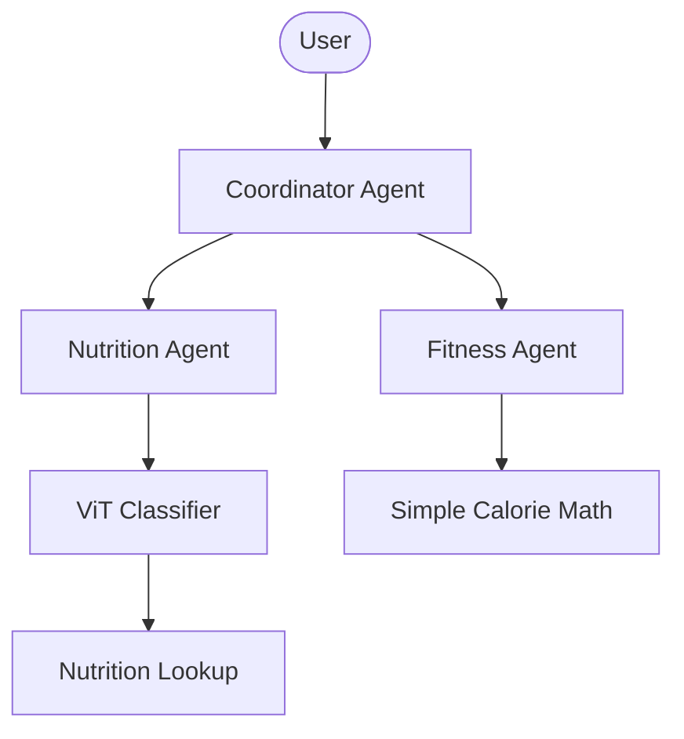
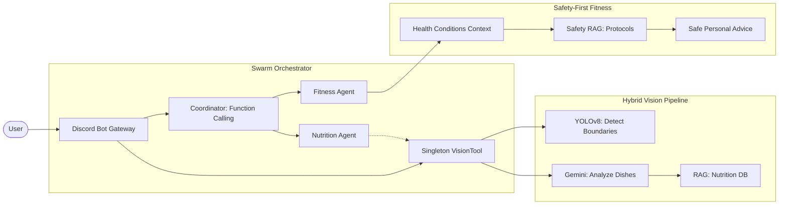

# Milestone 2 Report: Data Prep, Initial Modeling & Prototyping

## 1. Project Overview
The **Personal Health Butler AI** has transitioned from a conceptual framework to a functional multi-agent swarm prototype. This milestone marks a significant shift from simple classification to a sophisticated, safety-integrated vision and fitness orchestration system.

## 2. Data Preparation & Knowledge Integration
Our data strategy evolved to support multi-modal inputs and specialized nutritional/safety retrieval.

### A. Computer Vision Data & Detection
- **Multi-Object Focus**: We moved beyond single-category classification. The dataset now supports bounding box detection for overlapping food items.
- **Preprocessing**: Standardized to 640x640 resolution with augmentations (rotation, shear) to handle "real-world" kitchen and restaurant photography.

### B. Enhanced RAG (Knowledge Retrieval)
- **Nutritional RAG**: Stores 10,000+ entries in **ChromaDB**, ensuring that food names identified by Gemini are cross-referenced with scientific caloric data.
- **Safety RAG**: A new layer of knowledge containing medical/fitness restrictions (e.g., knee-friendly exercises, heart rate zones) to prevent the Fitness Agent from recommending harmful workouts.

## 3. Initial Modeling: The Architectural Pivot
The most critical development in Milestone 2 was the pivot from a monolithic classification model to a hybrid-intelligence pipeline.

### A. From Classification (ViT) to Detection (YOLO + Gemini)
Testing showed that users rarely take a photo of just "one apple." They take photos of complete meals.
- **The Problem**: A standard ViT (Vision Transformer) would look at a full tray and guess a single label (e.g., "Rice"), ignoring the side dishes.
- **The Solution (Hybrid Vision)**: 
  - **YOLOv8n**: Acts as the "Eyes," quickly identifying the number of items and their locations.
  - **Gemini 1.5 Flash**: Acts as the "Brain," identifying exactly *what* is inside those bounding boxes (ingredients, preparation method).

### B. Prototyping "The Swarm"
We abandoned traditional linear routing in favor of a **Decentralized Swarm**. The `HealthSwarm` orchestrator allows agents to share a **Singleton VisionTool** instance, minimizing memory overhead (~3GB) while maximizing response speed.

## 4. Architecture Evolution (Comparison)

### Phase 1: Experimental Monolith (Milestone 1 Design)
*   **Logic**: Linear and keyword-based.
*   **Vision**: Single-label classification (ViT).
*   **Fitness**: Basic math without health context.

### Phase 2: Hybrid Swarm Intelligence (Current Prototype)
*   **Logic**: Full context-aware orchestration via Gemini Function Calling.
*   **Vision**: Hybrid YOLOv8 + Gemini Flash.
*   **Fitness**: Safety-First integration (Health Conditions + Calorie Status).

## 5. Prototyping Results
- **Discord Integration**: Successfully implemented persistent gateway connections for live interaction.
- **Memory Management**: Optimized the large scientific stack (torch/transformers) to run efficiently within a 4GB Cloud Run instance.
- **Safety Filtering**: The system now correctly filters out high-impact exercises for users who specify knee pain in their profile.

## 6. Next Steps
- **Supabase Migration**: Store user profiles and conversation history for long-term tracking.
- **GCP Full Deployment**: Scale the Cloud Run service with "Always-on CPU" to maintain Gateway stability.
- **Model Refinement**: Fine-tune YOLO for smaller ingredient detection (e.g., nuts/seeds).
