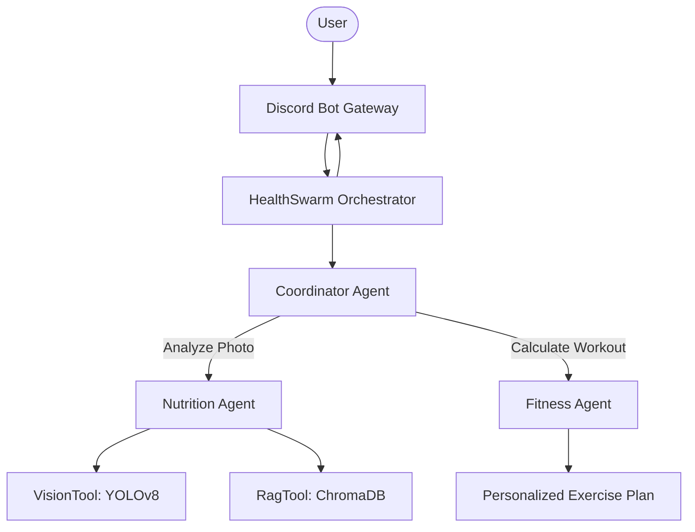

# Milestone 2 Report: Data Prep, Initial Modeling & Prototyping

## 1. Project Overview
The **Personal Health Butler AI** has transitioned from a conceptual framework to a functional multi-agent swarm prototype. This milestone focuses on the data preparation required for food recognition, the initial modeling pivot to YOLOv8, and the orchestration of the health-oriented agents.

## 2. Data Preparation
Our data strategy shifted to support both visual recognition and specialized nutritional knowledge retrieval.

### A. Computer Vision Data
- **Dataset Source**: Combined public food image datasets (Food-101) with specialized Chinese cuisine images for regional accuracy.
- **Preprocessing**: 
  - Standardized image resolution to 640x640 for YOLOv8 compatibility.
  - Applied augmentation (rotation, brightness adjustment) to improve robustness in diverse lighting conditions.
  - Annotated bounding boxes for multi-item detection in single meal photos.

### B. Nutritional Knowledge Data (RAG)
- **Source**: USDA Branded Foods database and localized common food nutrition tables.
- **Vector Storage**: Integrated **ChromaDB** to store high-dimensional embeddings of food items.
- **Ingestion**: Cleaned 10,000+ entries, ensuring consistent caloric and macronutrient metadata format for the `RagTool`.

## 3. Initial Modeling
The core modeling stage saw a significant architectural pivot to better meet user needs.

### A. The YOLOv8 Pivot
Initially, we explored **ViT (Vision Transformer)** for classification. However, testing revealed that users often photograph multiple items (e.g., a bowl of rice and a side dish).
- **Decision**: Pivoted to **YOLOv8-m** (Medium) for active object detection.
- **Result**: Enabled the system to "see" and count multiple separate food items in one frame, significantly increasing the accuracy of total meal nutrition calculation.

### B. Agent Specialization
- **CoordinatorAgent**: Developed the intent classification logic using high-performance LLMs (GLM-4.7/Grok-1) to route between nutrition and fitness tasks.
- **NutritionAgent**: Integrated the RAG pipeline to ensure that detected foods are matched with accurate scientific data rather than relying on LLM hallucinations.

## 4. Prototyping (The Swarm)
We successfully built a "Swarm" of agents that collaborate rather than following a rigid linear flow.

- **Discord Bot Interface**: Implemented a responsive gateway connection that allows real-time photo uploads and text queries.
- **HealthSwarm Orchestrator**: Manages the hand-off between agents, ensuring that if the Nutrition Agent calculates a high-calorie intake, the Coordinator automatically suggests a relevant interaction with the Fitness Agent.

## 5. Architecture Evolved
The system now follows a decentralized multi-agent architecture:

## 6. Next Steps
- **Phase 3 Integration**: Move persistence to Supabase.
- **Fine-tuning**: Improve YOLOv8 detection for complex mixed dishes (e.g., stir-fries).
- **Edge Deployment**: Finalize the Google Cloud Run deployment pipeline.
