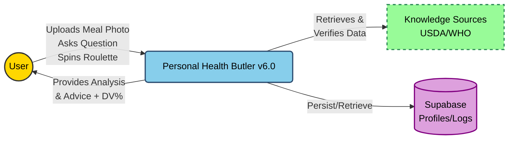
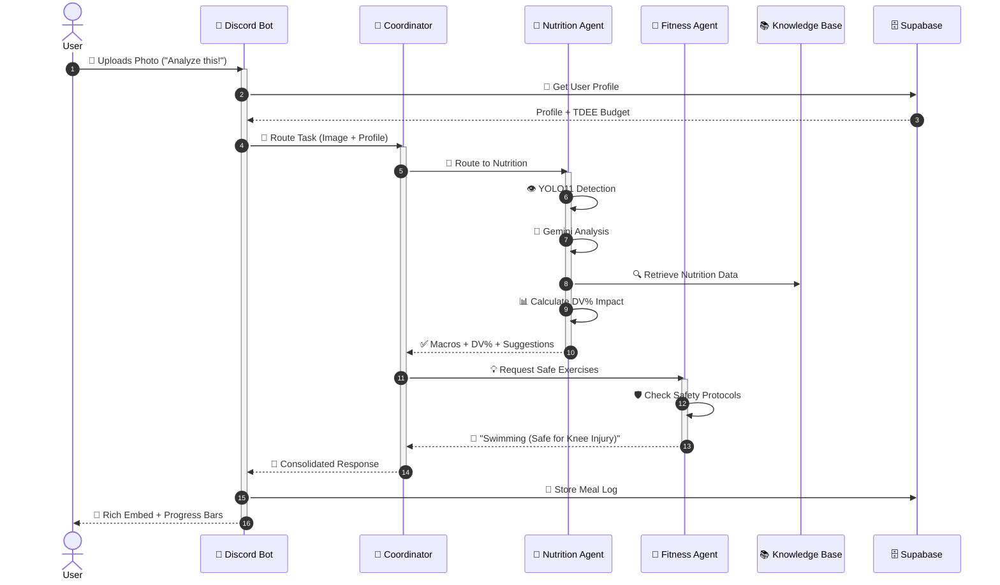
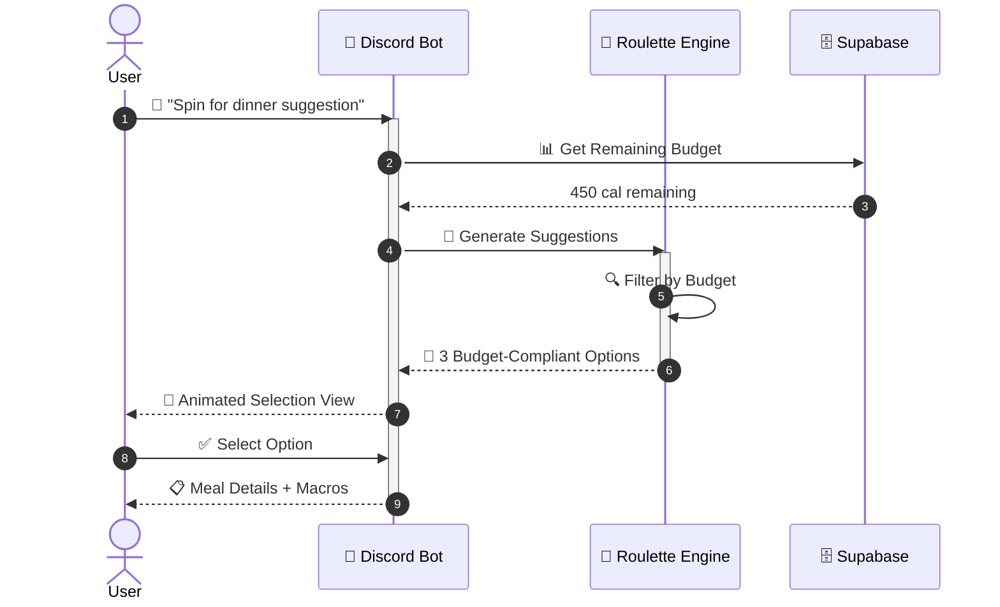
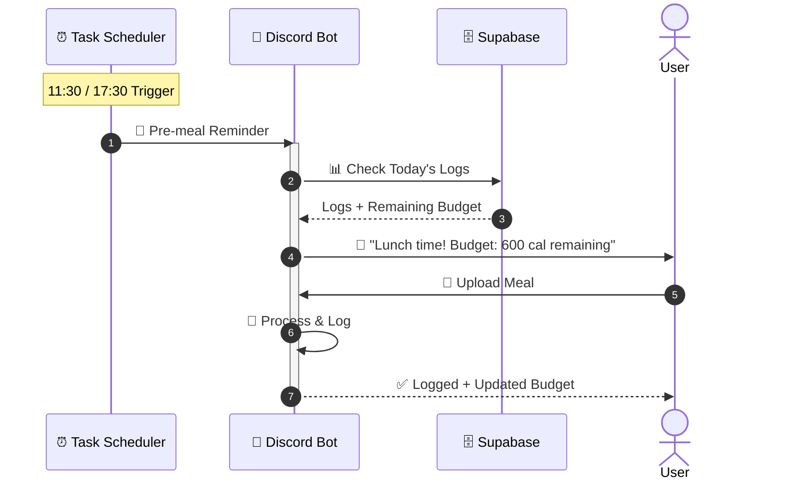

# L1 Business Architecture
# Personal Health Butler AI

> **Version**: 6.1
> **Last Updated**: March 10, 2026
> **Parent Document**: [PRD v6.0](./PRD-Personal-Health-Butler.md)
> **TOGAF Layer**: L1 - Business Architecture

---

## 1. Business Context & Strategy

### 1.1 Value Proposition Canvas

| Segment | Customer Job | Pains | Gains |
|---------|--------------|-------|-------|
| **Busy Professional (Alex)** | Track nutrition intake | Manual logging is tedious | **Visual Logging**: Snap a photo, done |
| | Maintain balanced diet | Generic advice is useless | **Personalized**: Suggestions based on *my* TDEE and DV% |
| | Get quick health answers | "Dr. Google" is unreliable | **Grounded**: Evidence-based answers (USDA/WHO) |
| | Decide what to eat | Decision fatigue at mealtime | **Gamified**: Food Roulette🎰 solves "what to eat" |
| | Remember to log meals | Forgetfulness | **Proactive**: Pre-meal reminders (11:30/17:30) |

**Product Value Map:**
- **Product**: AI Health & Nutrition Assistant (v6.0)
- **Pain Relievers**: Instant calorie/macro estimation with DV%, evidence-backed answers, gamified suggestions.
- **Gain Creators**: Daily summaries, budget-aware meal inspiration, persistent profiles.

### 1.2 Quantitative Business Goals (KPIs)

| Metric | Target | Business Value |
|--------|--------|----------------|
| **Efficiency** | Reduce logging time by >80% | High retention via easy visual logging |
| **Trust** | >98% Semantic Accuracy | Gemini-powered multimodal verification |
| **Safety** | Zero Critical Errors | Safety RAG filtering for health conditions |
| **Latency** | <5s for Initial Detection | Fast feedback via YOLO11 |
| **Engagement** | +40% DAU vs v5 | Food Roulette usage, reminder response |
| **Retention** | Persistent profiles | Supabase-backed user data |

---

## 2. Business Process Architecture

### 2.1 Level 0: Context Diagram

### 2.2 Level 1: Business Capability Map

| Strategic | Core | Support |
|-----------|------|---------|
| **Health Insights** - Nutrition Analysis - DV% Budget Tracking - Trend Forecasting | **Interaction** - Visual Recognition (YOLO11) - Natural Language QA - Food Roulette🎰 | **Knowledge Mgmt** - Data Ingestion - Compliance/Privacy |
| **Orchestration** - Intent Routing - Agent Coordination | **Action Planning** - Diet Recommendations - Exercise Adjustment - Meal Suggestions | **User Mgmt** - Persistent Profiles - Preference Storage - Proactive Reminders |

### 2.3 Level 2: Core Business Processes

#### process_01: Meal Analysis & Budget Tracking (v6.0)

#### process_02: Food Roulette🎰 (v6.0 NEW)

#### process_03: Proactive Reminders (v6.0 NEW)

---

## 3. Agent Collaboration Model

### 3.1 Agent Responsibility Matrix

| Agent | Role | Input | Output | Success Metric |
|-------|------|-------|--------|----------------|
| **Coordinator** | Traffic Control | User Query/media | Routed Task / Final Response | 99% routing accuracy |
| **Nutrition Agent** | Domain Expert | Image/Food Name + Profile | Macros + DV% + Diet Advice | 85% food recognition recall |
| **Fitness Agent** | Support Coach | Calorie surplus/deficit | Activity Recommendation | Relevant, safe suggestions |
| **Roulette Engine** | Gamification | Remaining budget + Preferences | Budget-compliant meal options | +40% engagement |
| **Task Scheduler** | Proactive Engagement | Time triggers | Reminder messages | Improved DAU |

### 3.2 Interaction Pattern (Star Topology)

- **Central Hub**: Coordinator Agent manages all state and routing.
- **Spokes**: Specialized agents (Nutrition, Fitness, Roulette) are stateless workers.
- **Persistence**: Supabase stores profiles, logs, and budgets.
- **Protocol**: JSON-structured messages (AgentTask → AgentResult).

---

## 4. Business Rules & Compliance

### 4.1 Ethical AI Rules (BR-ETHICS)

- **BR-001 (No Diagnosis)**: System MUST NOT provide medical diagnoses. All responses regarding symptoms must contain a disclaimer: "Consult a medical professional."
- **BR-002 (Bias Mitigation)**: Food recognition and health advice MUST cover diverse cultural diets and body types.
- **BR-003 (Citation)**: All health claims MUST cite a verified source (USDA, WHO, or peer-reviewed DB).

### 4.2 Privacy Rules (BR-PRIVACY) (GDPR/HIPAA-aligned)

- **BR-004 (Data Minimization)**: Only collect data strictly necessary for the immediate analysis.
- **BR-005 (Ephemeral Image Storage)**: User photos are processed in-memory and never persisted to disk.
- **BR-006 (Anonymization)**: Any analytics data MUST be stripped of all PII.
- **BR-007 (User Control)**: Users can delete their profiles and logs from Supabase at any time.

### 4.3 Gamification Rules (BR-GAME) - v6.0 NEW

- **BR-008 (Budget Compliance)**: Roulette suggestions MUST NOT exceed remaining calorie budget.
- **BR-009 (Preference Respect)**: Suggestions MUST respect dietary preferences (vegetarian, halal, etc.).

---

## 5. v6.0 Feature Summary

| Feature | Business Value | User Value |
|---------|----------------|------------|
| **YOLO11 Vision** | Higher accuracy → more trust | Better food recognition |
| **TDEE/DV% Budgeting** | Personalized insights | Know real daily impact |
| **Food Roulette🎰** | Increased engagement | Decision fatigue relief |
| **Proactive Reminders** | Higher DAU | Don't forget to log |
| **Supabase Persistence** | Better retention | Seamless cross-session experience |

---

**Document Status**: 🟢 Version 6.0 - Aligned with v6.0 Features
