# L1 Business Architecture
# Personal Health Butler AI

> **Version**: 1.1
> **Last Updated**: 2026-01-16
> **Parent Document**: [PRD v1.1](./PRD-Personal-Health-Butler.md)
> **TOGAF Layer**: L1 - Business Architecture

---

## 1. Business Context & Strategy

### 1.1 Value Proposition Canvas

| Segment | Customer Job | Pains | Gains |
|---------|--------------|-------|-------|
| **Busy Professional (Alex)** | Track nutrition intake | Manual logging is tedious | **Visual Logging**: Snap a photo, done |
| | Maintain balanced diet | Generic advice is useless | **Personalized**: Suggestions based on *my* history |
| | Get quick health answers | "Dr. Google" is unreliable | **Grounded**: Evidence-based answers (USDA/WHO) |

**Product Value Map:**
- **Product**: AI Nutrition Assistant
- **Pain Relievers**: Instant calorie/macro estimation, evidence-backed answers.
- **Gain Creators**: Weekly nutrition summaries, adaptive cheat-meal suggestions.

### 1.2 Quantitative Business Goals (KPIs)

| Metric | Target | Business Value |
|--------|--------|----------------|
| **Efficiency** | Reduce logging time by >50% (vs. text input) | Increases user retention/engagement |
| **Trust** | >95% RAG citation accuracy | Establishes credibility in health domain |
| **Latency** | <10s End-to-End Response | Mimics "human-like" interaction speed |

---

## 2. Business Process Architecture

### 2.1 Level 0: Context Diagram

### 2.2 Level 1: Business Capability Map

| Strategic | Core | Support |
|-----------|------|---------|
| **Health Insights** - Nutrition Analysis - Trend Forecasting | **Interaction** - Visual Recognition - Natural Language QA | **Knowledge Mgmt** - Data Ingestion - Compliance/Privacy |
| **Orchestration** - Intent Routing - Agent Coordination | **Action Planning** - Diet Recommendations - Exercise Adjustment | **User Mgmt** - Session Context - Preference Profile |

### 2.3 Level 2: Core Business Processes

#### process_01: Meal Analysis & Recommendation

```mermaid
sequenceDiagram
    autonumber
    actor User
    participant Coord as 🧠 Coordinator
    participant NutAg as 🍎 Nutrition Agent
    participant FitAg as 🏃 Fitness Agent
    participant KB as 📚 Knowledge Base

    box "Agent System" #f9f9f9
        participant Coord
        participant NutAg
        participant FitAg
    end

    User->>Coord: 📸 Uploads Photo ("What's in this?")
    activate Coord
    Coord->>NutAg: 🔄 Route Task (Image)
    activate NutAg
    NutAg->>NutAg: 🤖 Recognize Food (YOLO26)
    NutAg->>KB: 🔍 Retrieve Calorie/Macro Data
    activate KB
    KB-->>NutAg: 📄 Knowledge Chunks
    deactivate KB
    NutAg->>NutAg: 🧮 Calculate Totals
    NutAg-->>Coord: ✅ Analysis Result + Initial Advice
    deactivate NutAg
    
    par Parallel Value Add
        Coord->>FitAg: 💡 Request Calorie Burn Suggestion
        activate FitAg
        FitAg-->>Coord: 🚶 "Walk 30 mins to offset"
        deactivate FitAg
    end

    Coord->>User: 💬 Consolidated Response (Macros + Advice)
    deactivate Coord
```

#### process_02: Evidence-Based Q&A

```mermaid
sequenceDiagram
    autonumber
    actor User
    participant Coord as 🧠 Coordinator
    participant RAG as 🔎 RAG Pipeline

    User->>Coord: ❓ "Is keto good for high blood pressure?"
    activate Coord
    Coord->>RAG: 🕵️ Semantic Search (Query)
    activate RAG
    RAG->>RAG: 📖 Retrieve Verified Sources (WHO/NIH)
    RAG-->>Coord: 📑 Critical Context & Citations
    deactivate RAG
    Coord->>User: 🗣️ Answer with [Source: NIH] citations
    deactivate Coord
```

---

## 3. Agent Collaboration Model

### 3.1 Agent Responsibility Matrix

| Agent | Role | Input | Output | Success Metric |
|-------|------|-------|--------|----------------|
| **Coordinator** | Traffic Control | User Query/media | Routed Task / Final Response | 99% routing accuracy |
| **Nutrition Agent** | Domain Expert | Image/Food Name | Macros + Diet Advice | 85% food recognition recall |
| **Fitness Agent** | Support Coach | Calorie surplus/deficit | Activity Recommendation | Relevant, actionable suggestions |

### 3.2 Interaction Pattern (Star Topology)

- **Central Hub**: Coordinator Agent manages all state and routing.
- **Spokes**: Specialized agents (Nutrition, Fitness) are stateless workers.
- **Protocol**: JSON-structured messages (AgentTask -> AgentResult).

---

## 4. Business Rules & Compliance

### 4.1 Ethical AI Rules (BR-ETHICS)

- **BR-001 (No Diagnosis)**: System MUST NOT provide medical diagnoses. All responses regarding symptoms must contain a disclaimer: "Consult a medical professional."
- **BR-002 (Bias Mitigation)**: Food recognition and health advice MUST cover diverse cultural diets and body types.
- **BR-003 (Citation)**: All health claims MUST cite a verified source (USDA, WHO, or peer-reviewed DB).

### 4.2 Privacy Rules (BR-PRIVACY) (GDPR/HIPAA-aligned)

- **BR-004 (Data Minimization)**: Only collect data strictly necessary for the immediate analysis.
- **BR-005 (Ephemeral Storage)**: User photos and chat history are stored only for the active session duration and purged on logout/timeout.
- **BR-006 (Anonymization)**: Any data used for improving the system MUST be stripped of all PII.

---

**Document Status**: 🟢 Draft v1.1 - Aligned with MVP Scope
