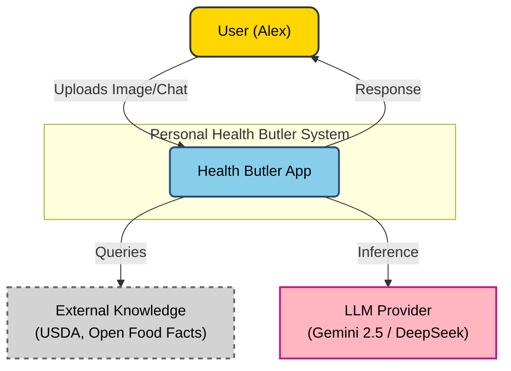
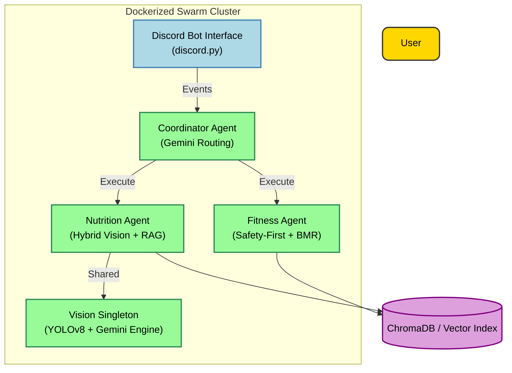

# L2 Application Architecture
# Personal Health Butler AI

> **Version**: 1.1
> **Last Updated**: 2026-01-16
> **Parent Document**: [PRD v1.1](./PRD-Personal-Health-Butler.md)
> **TOGAF Layer**: L2 - Application Architecture

---

## 1. System Overview

### 1.1 C4 Level 1: System Context



### 1.2 C4 Level 2: Container Diagram



---

## 2. Component Design (Modular MVP)

### 2.1 Service Catalog

| Agent | Responsibility | Key Tech | Status |
|---------|----------------|----------|--------|
| **Discord Bot** | Multi-modal entry point, Onboarding | discord.py | Deployed |
| **Coordinator** | Task Decomposition, LLM Routing | Google GenAI | High Fidelity |
| **Nutrition Agent**| Food Identity & Macro Breakdown | YOLOv8n, Gemini Flash | Hybrid Implemented |
| **Fitness Agent** | Safety-filtered coaching | Enhanced RAG, MSJ BMR | Context-Aware |

### 2.2 Component: Hybrid Vision System
**The core "Eye" of the system, shared via Singleton pattern.**
- **Stage 1: YOLOv8 (Physical)**: Detects food boundaries and count (locally).
- **Stage 2: Gemini Flash (Semantic)**: Detailed identification of ingredients, portions, and hidden macros.
- **RAG Verification**: Cross-references Gemini output with USDA nutritional database for verification.

### 2.3 Component: Safety-First Fitness
**Protects the user using medical-grade filtering logic.**
- **Condition Mapping**: Links health conditions (e.g. Heart Disease) to forbidden exercise patterns.
- **Dynamic BMR**: Calculates daily expenditure using user profile metrics.
- **Surplus/Deficit Logic**: Adjusts exercise intensity based on real-time nutrition logs.

---

## 3. Technology Stack & Integration

### 3.1 LLM Strategy (Tiered)

| Tier | Model | Use Case | Justification |
|------|-------|----------|---------------|
| **Primary** | **Gemini 2.5 Flash** | General Reasoning, Synthesis | Low cost, high speed, multimodal native |
| **Fallback** | **DeepSeek-V3 / GLM-4** | Complex reasoning (if needed) | Open weight / Cost effective |
| **Embedding** | **e5-large-v2** | Knowledge Retrieval | Best-in-class open embedding |

### 3.2 Computer Vision

- **Model**: **YOLO26 (Nano/Small)**
- **Optimization**: ONNX Runtime or TorchScript for CPU inference optimization.
- **Dataset**: Pre-trained on COCO, Fine-tuned on **Food-101**.

---

## 4. State Management

### 4.1 Implementation
- **Session State**: Managed in-memory via Streamlit Session State (ephemeral).
- **Conversation Memory**: `LangChain.memory.ConversationBufferWindowMemory` (k=5 rounds).

### 4.2 Data Flow

1. **User Upload** -> UI stores in RAM.
2. UI calls **Coordinator** with inputs.
3. Coordinator maintains short-term conversational context.
4. Coordinator calls **Nutrition Agent**.
5. Nutrition Agent runs **YOLO** (stateless).
6. Result returns to UI for display.
7. **No persistent DB** for user data (Privacy by Design).

---

## 5. Security Architecture (Zero Trust Lite)

- **API Security**: Although internal, services use strict Pydantic validation.
- **Secret Management**: `.env` files for keys (Gemini API, etc.), strictly git-ignored.
- **Input Sanitization**: All text inputs scanned for prompt injection markers before LLM processing.

---

## 6. Deployment View (Cloud Run)

```yaml
# Simplified Structure
services:
  app:
    image: health-butler-mvp:latest
    ports: [8080]
    env_file: .env
    resources:
      memory: 4GB  # Enough for YOLO + FAISS
```

**Scalability Strategy**:
- Cloud Run automatically scales to 0 when unused (Cost saving).
- Stateless design allows horizontal scaling if demo traffic spikes.

---

**Document Status**: 🟢 Draft v1.1 - Modular MVP Design
