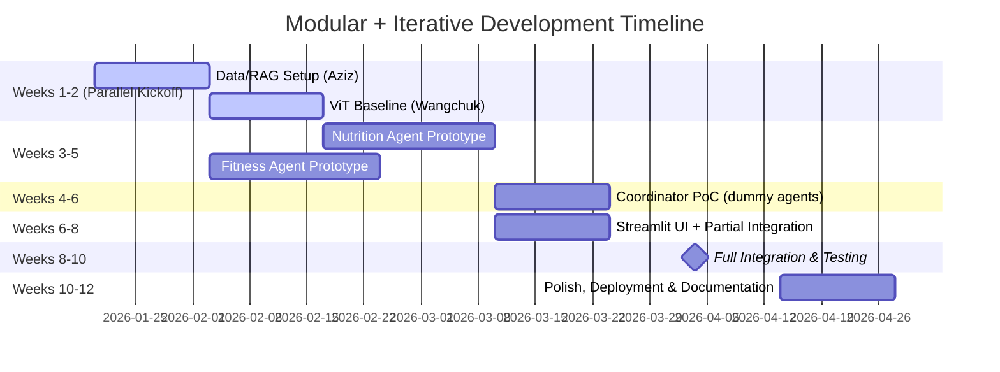

# Product Requirements Document (PRD)
**Personal Health Butler AI **  
**Version**: 1.2 (Architecture Pivot)  
**Last Updated**: January 21, 2026  
**Team**: Group 5 (Allen, Wangchuk, Aziz, Kevin)  
**Status**: 🟢 In Development (Phase 2)  

### Document History
| Version | Date | Author | Description of Change |
| :--- | :--- | :--- | :--- |
| **1.0** | 2026-01-10 | Group 5 | Initial Draft |
| **1.1** | 2026-01-16 | Group 5 | Finalized for Milestone 1 MVP Scope |
| **1.2** | 2026-01-21 | Kevin (Docs) | **Architecture Pivot**: Replaced YOLO26 (Detection) with **ViT (Vision Transformer)** for simpler integration and higher out-of-box accuracy on Food-101. |

---

### 1. Executive Summary

#### 1.1 Product Vision
The **Personal Health Butler AI** is a streamlined, AI-powered nutrition-focused assistant that leverages **Multi-Agent Architecture** and **Retrieval-Augmented Generation (RAG)** to deliver personalized, evidence-based wellness guidance. Users upload meal photos, and the system analyzes food, provides calorie/macro breakdowns, and offers simple follow-up diet/exercise suggestions grounded in reliable knowledge sources.

#### 1.2 Problem Statement
Current health apps often provide generic or ungrounded advice, lack integration across nutrition and fitness, and fail to deliver quick, visual-input-based insights. This MVP addresses these by focusing on **meal photo analysis** with trustworthy, cited recommendations.

#### 1.3 Proposed Solution (MVP)
A Multi-Agent system with:
- Coordinator routing user inputs
- Nutrition Agent for photo-based analysis + RAG-grounded advice
- Fitness Agent for simple follow-up suggestions
- Streamlit UI for seamless interaction
- Strict focus on nutrition domain for depth and reliability

---

### 2. Project Scope

#### 2.1 In-Scope (MVP - P0 Must-Have)
- **Multi-Agent Orchestration**: Coordinator + Nutrition Agent + Fitness Agent (using LangGraph for agentic flow)
- **RAG Knowledge Pipeline**: Nutrition-focused vector DB (FAISS) with retrieval and grounding
- **Food Recognition**: ViT-based classification (HuggingFace `nateraw/food-vit-101`) from uploaded images
- **Nutrition Analysis**: Calorie/macro estimation + evidence-based dietary suggestions
- **Streamlit Dashboard**: User interface for photo upload, text queries, session management, and evidence display
- **Simple User Profile/Session**: Basic goals/preferences stored ephemerally

#### 2.2 Out-of-Scope (Phase 2 or Future Extensions)
- Mental Health Agent
- Posture Analysis (MediaPipe)
- Voice Input (Whisper)
- Predictive Analytics (LSTM/Prophet trends)
- Smart Grocery Recommendations
- Wearable Device Integration
- Real medical diagnosis or multi-language support

#### 2.3 Success Criteria
| Metric                             | Target          | Measurement Method                              |
| ---------------------------------- | --------------- | ----------------------------------------------- |
| Food recognition accuracy          | ≥85%            | Test set evaluation (Food-101 subset)           |
| RAG retrieval relevance (Recall@5) | ≥80%            | Human evaluation on 50 sample nutrition queries |
| End-to-end response latency        | <10s (P95)      | End-to-end timing in demo scenarios             |
| Demo completeness                  | 100% functional | 3 core scenarios fully working in Streamlit     |

---

## 3. User Stories

### 3.1 Primary Persona

**Name**: Alex (Demo User) **Age**: 30 **Location/Context**: Busy professional in Toronto, Canada; enjoys diverse foods but aims for balanced nutrition. **Goals**: Improve overall health through better meal tracking and simple fitness integration. **Pain Points**:

- Unsure of meal calories/macros
- Needs evidence-based suggestions
- Wants quick, visual input methods

### 3.2 User Story Map

text

```
┌─────────────────────────────────────────────────────────────────────┐
│                         User Journey                                 │
├──────────────┬──────────────┬──────────────┬───────────────────────┤
│  Onboarding  │  Daily Use   │   Analysis   │     Adjustment        │
├──────────────┼──────────────┼──────────────┼───────────────────────┤
│ Set goals    │ Log meal     │ View macros  │ Get suggestions       │
│ Input prefs  │ Ask questions│ See evidence │ Adjust plan           │
└──────────────┴──────────────┴──────────────┴───────────────────────┘
```

### 3.3 Core User Stories

| ID    | As a... | I want to...                                             | So that...                              | Priority |
| ----- | ------- | -------------------------------------------------------- | --------------------------------------- | -------- |
| US-01 | User    | Upload a photo of my meal                                | I can get calories/macros + suggestions | P0       |
| US-02 | User    | Get personalized meal suggestions based on recent intake | I can eat healthier                     | P0       |
| US-03 | User    | Ask natural language questions about nutrition/fitness   | I get evidence-based answers            | P0       |

------

## 4. Functional Requirements

### 4.1 Multi-Agent System

#### FR-001: Coordinator Agent

- **Description**: Routes user input to agents and synthesizes responses
- **Input**: Text/photo + context
- **Output**: Integrated response with evidence
- **Acceptance Criteria**: Routes correctly, synthesizes coherently

#### FR-002: Nutrition Agent

- **Description**: Analyzes food photo and provides nutrition advice
- **Input**: Image + query
- **Output**: Calories/macros + suggestions (RAG-grounded)

#### FR-003: Fitness Agent

- **Description**: Generates simple exercise suggestions based on nutrition input
- **Input**: Nutrition data + user goals
- **Output**: Personalized recommendations

#### FR-004: RAG Pipeline

- **Description**: Retrieves and grounds knowledge
- **Input**: Query
- **Output**: Relevant chunks with sources

#### FR-005: UI & Session

- **Description**: Handles user interaction
- **Input**: Uploads/queries
- **Output**: Displayed results/session persistence

------

## 5. Non-Functional Requirements

- **Performance**: <10s E2E, <3s image processing
- **Privacy**: Ephemeral data, no PII stored
- **Cost**: LLM budget <$10/month
- **Scalability**: Demo-scale (single instance)

------

## 6. Technical Stack Summary

- **Core**: LangGraph (orchestration), Gemini 2.5 Flash (primary LLM), DeepSeek/GLM fallback
- **CV**: ViT (Transformer-based Classification)
- **RAG**: FAISS + sentence-transformers
- **Data**: USDA API (1000+ foods) + Open Food Facts backup
- **UI**: Streamlit
- **Deployment**: Docker + GCP Cloud Run

------

## 7. Development Approach (Recommended: Modular + Iterative)

#### Why Modular & Iterative (instead of Waterfall)?

The project adopts a **modular + iterative development approach** rather than a traditional linear waterfall model. This is better suited for AI/ML-heavy capstone projects because:

- AI components (YOLO fine-tuning, RAG quality, agent coordination) require experimentation and frequent iteration.
- Modules can be developed and tested independently, reducing integration risks.
- Allows parallel work by 4 team members, with clear ownership and early feedback.
- Aligns with 2026 AI development best practices (e.g., build independent components first, integrate late).

#### Module Breakdown & Ownership

The system is decomposed into highly decoupled modules. Each module has:

- Clear input/output interface
- Independent test/demo script
- Mini-milestone for validation

| Module Name                      | Owner                        | Primary Deliverable (Independent)                            | Dependencies (Minimal)               | Target Completion |
| -------------------------------- | ---------------------------- | ------------------------------------------------------------ | ------------------------------------ | ----------------- |
| 1. Data & RAG Pipeline           | Wangchuk                     | USDA/Open Food Facts data ingestion, chunking, FAISS index, simple retrieval demo | None                                 | Week 2–4          |
| 2. CV / Food Recognition         | Wangchuk                     | YOLO26 baseline, Food-101 download, inference script (image → JSON foods list) | None                                 | Week 2–5          |
| 3. Nutrition Agent               | Wangchuk (lead) + Aziz (RAG) | YOLO output + RAG → nutrition analysis & suggestions (standalone script) | Module 1 & 2 outputs (mock OK)       | Week 4–6          |
| 4. Fitness Agent                 | Kevin                        | User profile + nutrition input → exercise suggestions (rule-based + RAG) | Mock nutrition input                 | Week 4–6          |
| 5. Coordinator & Orchestration   | Allen                        | LangGraph graph, intent routing, response synthesis (with dummy agents first) | Agent interfaces                     | Week 5–7          |
| 6. Streamlit UI + Session        | Wangchuk + Allen             | Photo upload, chat interface, evidence display, ephemeral session | Single agent first, then Coordinator | Week 6–8          |
| 7. Full Integration & Deployment | Allen (lead) + All           | End-to-end flow, latency testing, Cloud Run deployment, 3 demo scenarios | All modules                          | Week 8–10         |

#### Interface Contracts (To Be Defined in Week 1–2)

All modules will follow agreed JSON/Pydantic interfaces to ensure loose coupling. Examples:

- ViT Output: {"foods": [{"name": "pizza", "confidence": 0.92}]}
- RAG Output: [{"content": "str", "source": "USDA", "score": 0.85}]
- Agent Input/Output: Standardized run(input_dict) → output_dict

#### Adjusted Timeline (12 Weeks, Parallel & Iterative)




#### Key Practices for Success

- **Weekly Sync**: 30-min Discord every Sunday → each member demos their module progress (screenshot/video).

- **Mocking**: Use dummy data/outputs during early development to avoid blocking.

- **Testing**: Each module has its own test script (pytest or simple main block).

- **Repo Structure** (suggested):

  text

  ```
  src/
  ├── data_rag/          # Aziz
  ├── cv_food_rec/       # Wangchuk
  ├── agents/
  │   ├── nutrition/     # Wangchuk + Aziz
  │   └── fitness/       # Kevin
  ├── coordinator/       # Allen
  └── ui_streamlit/      # Wangchuk + Allen
  ```

- **Milestone Alignment**:

  - MS1 (Week 3): Module breakdown diagram + first baselines (ViT inference, RAG retrieval demo)
  - MS2 (Week 6): All individual prototypes running independently
  - MS3 (Week 9): Partial integration (e.g., Nutrition chain complete)
  - MS4 (Week 12): Full system + deployment

This approach minimizes risk, maximizes parallel progress, and ensures tangible deliverables at every milestone.

------

## 8. Team Roles & Responsibilities

| Member       | Primary Role             | Modules                                        | Secondary          |
| ------------ | ------------------------ | ---------------------------------------------- | ------------------ |
| **Allen**    | Agent Orchestration Lead | Coordinator, LangGraph, Integration/Deployment | Full-stack support |
| **Wangchuk** | UI/CV Lead               | Streamlit, Nutrition Agent (ViT)               | Data exploration   |
| **Aziz**     | RAG/Data Lead            | RAG Pipeline, FAISS, USDA                      | Knowledge curation |
| **Kevin**    | Fitness/Docs Lead        | Fitness Agent, Documentation                   | Deployment polish  |

### 8.1 Responsibility Matrix (RACI)

| Task                  | Allen | Wangchuk | Aziz | Kevin |
| --------------------- | ----- | -------- | ---- | ----- |
| Agent Framework Setup | R     | C        | I    | I     |
| RAG Pipeline          | C     | I        | R    | I     |
| Food Detection Model  | C     | R        | I    | I     |
| Streamlit Dashboard   | C     | R        | I    | I     |
| Integration Testing   | R     | C        | C    | C     |
| Documentation         | I     | I        | I    | R     |

**R** = Responsible, **A** = Accountable, **C** = Consulted, **I** = Informed

------

## 9. Risks & Mitigation

| Risk                         | Impact | Probability | Mitigation                                                   |
| ---------------------------- | ------ | ----------- | ------------------------------------------------------------ |
| LLM cost overrun             | High   | Medium      | Monitor usage, use low-cost Gemini + caching; fallback to DeepSeek/GLM |
| ViT accuracy below target    | Medium | Medium      | Use fallback model (Google ViT base); allow user correction  |
| Data quality issues          | Medium | Low         | Verified sources (USDA + Open Food Facts); manual checks     |
| Integration delays           | High   | Medium      | Modular design + mocks; weekly syncs                         |

------

## 10. Open Questions (Resolved)

All resolved per team discussion (e.g., LLM: Gemini primary; RAG: LangGraph).

------

## 11. Appendix

### 11.1 Glossary

- RAG: Retrieval-Augmented Generation
- Multi-Agent: Collaborative AI agents
- ViT: Vision Transformer

### 11.2 References

- USDA API: [https://fdc.nal.usda.gov/api-guide.html](https://fdc.nal.usda.gov/api-guide.html?referrer=grok.com)
- HuggingFace ViT: [https://huggingface.co/nateraw/food-vit-101](https://huggingface.co/nateraw/food-vit-101)
- LangGraph: [https://langchain-ai.github.io/langgraph/](https://langchain-ai.github.io/langgraph/?referrer=grok.com)
